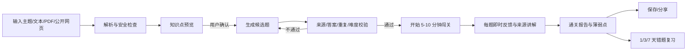

# AI 互动闯关学习微信小程序《可行性分析文档》

> 文档版本：v1.0  
> 研究日期：2026-08-26  
> 目标市场：中国大陆  
> 产品阶段：立项前 / MVP 可行性验证  
> 结论：**Conditional Go（有条件推进）**

---

## 0. 执行摘要

### 0.1 一句话结论

项目值得用低成本 MVP 验证，但**不建议以“输入任何知识，AI 自动出题”这一宽泛卖点直接投入完整开发**。这一能力技术上容易实现，国内外竞品也已普遍具备；真正有机会形成差异化的是：

> **在微信内，把用户自己的可信资料快速变成一局 5–10 分钟、答案可追溯、答完能复习、可以轻量分享的互动闯关。**

建议首发用户优先选择**成年职场学习者、证书/面试备考者和企业培训参与者**，而不是一开始覆盖所有年龄和所有知识。首版聚焦文本、文本型 PDF 和公开网页；全网搜索、任意视频、图片出题、PK、排行榜、数字人和充值体系暂缓。

### 0.2 为什么是 Conditional Go

| 维度 | 判断 | 主要依据 |
|---|---|---|
| 市场需求 | 中高 | 截至 2025 年末，中国在线教育用户为 3.27 亿，生成式 AI 用户为 6.02 亿；但两者的交集和本产品付费意愿尚未被直接证明 |
| 渠道可行性 | 高 | 微信/WeChat 合并月活达 14.11 亿；小程序入口轻、无需安装、适合低频和分享型场景 |
| 学习机制 | 中高 | 检索练习、及时反馈和适度游戏化有研究支持，但游戏化对动机与长期行为的效果并非在所有场景都稳定 |
| 技术可行性 | 高 | 文档解析、结构化出题、即时讲解、学习报告和微信云端部署均已有成熟能力 |
| 竞争强度 | 高 | Quizlet、Gizmo、StudyFetch、Quizbot、匡优考试、考试宝等已经覆盖资料导入、AI 出题、学习模式或游戏化 |
| 商业可行性 | 中 | 模型调用成本很低，但国内用户是否会为通用 AI 学习工具持续付费、获客成本和留存仍未验证 |
| 合规可控性 | 中 | 使用已备案模型、AI 内容标识、APP/小程序备案、未成年人保护、个人信息和版权均可设计规避，但会显著影响产品边界 |

### 0.3 立项建议

批准一个**6–8 周、分阶段、设停止线的验证项目**，而不是批准完整产品建设：

1. 先用原型和人工辅助服务验证“用户是否愿意上传自己的资料并完成闯关”。
2. 再开发仅覆盖文本、PDF 和公开网页的微信 MVP。
3. 只有达到题目质量、首次通关、7 日复用和付费意愿门槛，才进入视频、RAG、社交 PK 和商业化开发。

---

## 1. 项目定义与分析边界

### 1.1 产品定义

用户输入一个主题或提供一份学习材料，系统提取知识点，自动生成题目、选项、答案和讲解。用户逐题闯关，立即获得反馈，通关后得到知识总结、薄弱点和复习建议，并可保存或分享结果。

### 1.2 本文要回答的问题

1. 是否存在足够大的目标用户和高频/高价值需求？
2. 微信小程序是否是合适的首发载体？
3. AI 自动出题和讲解能否达到可用质量？
4. 产品与现有工具相比有什么可持续差异？
5. 商业模式、成本和合规风险是否可控？
6. 应该做什么样的 MVP，以及什么情况下应停止？

### 1.3 研究口径

- 以中国大陆市场为主，海外产品用于能力和体验对标。
- 以个人或小团队、控制初期成本为前提。
- 事实尽量使用官方、监管、论文或产品一手页面；无法验证的商业数字不作为立项依据。
- 竞品功能来自公开页面，不等同于完整实测；价格、平台政策和模型费用在上线前必须再次核验。
- 本文中的开发周期、转化门槛和价格均为**验证假设或项目估算**，不是行业平均值。

---

## 2. 市场与用户分析

### 2.1 市场信号

1. **在线学习已有大规模用户基础。**CNNIC 第 57 次《中国互联网络发展状况统计报告》显示，截至 2025 年 12 月，中国在线教育用户规模为 **3.27 亿人**。[来源：CNNIC](https://www3.cnnic.cn/n4/2026/0304/c88-11549.html)
2. **用户使用生成式 AI 的门槛正在迅速下降。**同一报告显示，生成式 AI 用户规模达到 **6.02 亿人、普及率 42.8%**；第 56 次报告还显示，2025 年 6 月生成式 AI 用户中学生占 37.8%，企业/公司职员占 16.5%。[来源：CNNIC 第57次报告](https://www3.cnnic.cn/n4/2026/0304/c88-11549.html)、[CNNIC 第56次报告 PDF](https://cnnic.cn/NMediaFile/2025/0730/MAIN1753846666507QEK67ZS9DH.pdf)
3. **微信是足够大的触达渠道，但大渠道不等于自然流量。**腾讯披露，截至 2025 年 6 月微信及 WeChat 合并月活为 **14.11 亿**；2024 年小程序促成的 GMV 超过 8 万亿元。这个数字证明生态容量和交易基础，不证明教育小程序会自动获得用户。[来源：腾讯 2025 中期报告](https://static.www.tencent.com/uploads/2025/09/15/a91e39e8822813432efb3d3b511199e2.pdf)、[腾讯 2025 年报](https://static.www.tencent.com/uploads/2025/09/16/5a0b274dacf222d262734936c3508821.pdf)

### 2.2 市场规模的正确解读

- 上述 3.27 亿在线教育用户是 **TAM 需求信号**，不能直接当作本产品可服务市场。
- 在线教育用户、生成式 AI 用户和微信用户高度重叠，但缺少公开的三者联合分布数据，不能把比例简单相乘。
- 本项目真正的 SAM 是：**有明确学习目标、已有一份资料、愿意用手机做短时主动练习的人**。
- SOM 必须通过真实获客和复用实验获得，现阶段不应编造营收规模。

### 2.3 用户细分与优先级

| 用户群 | 典型任务 | 痛点强度 | 使用频率 | 付费潜力 | 合规复杂度 | 优先级 |
|---|---|---:|---:|---:|---:|---:|
| 职业证书/面试备考者 | 把讲义、岗位资料、法规变成练习 | 高 | 中高 | 中高 | 中 | **P0** |
| 成年职场学习者 | 学行业报告、产品文档、培训资料 | 中高 | 中 | 中 | 低 | **P0** |
| 企业培训管理员 | 上传内部资料、分发闯关、看完成情况 | 高 | 中高 | 高 | 中高 | P1 |
| 教师/培训讲师 | 从课件生成练习并分享 | 高 | 中 | 中高 | 中高 | P1 |
| K12 学生及家长 | 教材、错题、知识点练习 | 高 | 高 | 高 | **高** | P2 |
| 泛知识兴趣用户 | 任意主题即时挑战 | 低到中 | 低 | 低 | 中 | 获客内容，不作为首发核心 |

### 2.4 推荐首发用户画像

**25–40 岁、正在准备证书/面试或学习工作资料的微信用户。**他们已有 PDF、网页或笔记，有明确截止时间，愿意用碎片时间学习，同时可以避开首版直接服务低龄用户带来的额外合规和教研压力。

核心 Job-to-be-Done：

> “我已经有资料，但读起来太被动、也不知道自己是否真正记住了；我希望几分钟内把它变成能立即练习、发现薄弱点的题。”

---

## 3. 需求场景

| 场景 | 触发时刻 | 输入 | 期望结果 | 价值等级 |
|---|---|---|---|---:|
| 面试前速刷 | 面试前 1–7 天 | 岗位要求、面经、技术文档 | 10 题挑战 + 错题讲解 + 薄弱点 | 高 |
| 证书章节复习 | 学完一章后 | PDF/笔记 | 分难度练习 + 次日复习 | 高 |
| 企业培训验收 | 员工读完制度后 | 内部培训文档 | 统一闯关 + 完成报告 | 高，但属 P1 |
| 文章读后自测 | 读完深度文章后 | 公开网页 | 核心观点测验 + 总结 | 中高 |
| 老师快速出练习 | 备课或课后 | PPT/PDF/讲义 | 可编辑题目 + 分享链接 | 中高，但属 P1 |
| 好友挑战 | 学到有趣知识时 | 已生成题组 | 分享成绩卡并邀请答题 | 中，主要用于传播 |
| 任意主题娱乐问答 | 无明确资料时 | 一句话主题 | 即时趣味题 | 中低，适合拉新但质量风险高 |

---

## 4. 痛点验证

### 4.1 已有证据支持的痛点

| 痛点 | 证据 | 证据强度 | 产品含义 |
|---|---|---:|---|
| 被动阅读不等于掌握 | 检索练习研究显示，主动回忆能促进概念学习 | 高 | 产品核心应是“先答再讲”，而不是先生成长篇摘要 |
| 出题和整理资料耗时 | 多个中外产品都将“上传资料立即生成题目”作为核心卖点 | 中 | 需求真实，但功能已商品化 |
| 答错后不知道为什么 | 反馈研究覆盖 435 项研究、6.1 万余名学习者，支持反馈对学习的重要性 | 高 | 每题必须提供针对选项和来源的解释 |
| 学习缺乏持续动力 | 游戏化元分析显示认知、动机和行为结果存在小幅正效应，但异质性明显 | 中 | 只做积分/徽章不够，必须与学习目标、复习节奏结合 |
| AI 题目可能有错或太浅 | 近期系统综述显示部分强模型可接近人工题目质量，但证据确定性很低，且仍需事实核验 | 高 | 题目质量控制是产品能力，不是后台细节 |

学习机制参考：[检索练习研究（PubMed）](https://pubmed.ncbi.nlm.nih.gov/21252317/)、[游戏化学习元分析（Springer）](https://doi.org/10.1007/s10648-019-09498-w)、[教育反馈元分析（PMC）](https://pmc.ncbi.nlm.nih.gov/articles/PMC6987456/)、[LLM 生成选择题系统综述（PLOS One）](https://journals.plos.org/plosone/article?id=10.1371%2Fjournal.pone.0340277)

### 4.2 仍未验证的关键假设

以下问题不能靠桌面研究回答，必须通过用户实验：

1. 用户是否愿意把自己的工作/备考资料上传给一个新小程序？
2. “生成一套题”之后，用户是否会在 7 天内再次回来，而不是只体验一次？
3. 用户更在意趣味性、节省时间、题目可信度，还是复习效果？
4. 个人用户是否愿意为生成次数、复习计划或高质量题目付费？
5. 微信分享能否带来真正答题，而不只是生成一张无人点击的成绩卡？

### 4.3 痛点判断

- **确认存在：**把资料转为主动练习、即时获得反馈、快速发现薄弱点。
- **部分确认：**游戏化能提高短期参与，但不能保证长期留存。
- **尚未确认：**泛知识用户的持续使用、国内 B2C 付费意愿、自然分享增长。

---

## 5. 竞品调研与竞品矩阵

### 5.1 竞品矩阵

> “—”表示公开页面未确认，不代表产品一定没有；竞品功能与价格需在正式立项后进行账号实测。

| 产品 | 主要输入 | AI 生成题目 | 学习/反馈机制 | 游戏化与复习 | 分享/管理 | 核心优势 | 对本项目的威胁 |
|---|---|---|---|---|---|---|---|
| [Quizlet](https://quizlet.com/features/ai-test-generator/) | 文本、PDF、DOCX、PPTX、Drive | 有 | 练习测试、学习模式、强弱项反馈 | 多种学习活动 | 班级、内容库 | 品牌、内容生态、成熟学习闭环 | 高；证明“AI 出题”不是壁垒 |
| [Gizmo](https://help.gizmo.ai/en/articles/14472668-how-does-gizmo-work) | PDF、笔记、YouTube、录音 | 有 | AI Tutor、智能卡片 | 间隔重复、XP、等级、联赛、连续学习 | Deck | 游戏化与记忆机制接近本构想 | **很高；近似直接竞品** |
| [StudyFetch](https://www.studyfetch.com/) | PDF、PPT、视频、课件 | 有 | AI Tutor、学习计划、笔记 | Arcade 游戏式挑战 | 学习资料空间 | 功能完整、个性化和多模态 | **很高；功能上限标杆** |
| [Quizbot](https://quizbot.ai/zh) | PDF、PPT、Word、网页、视频、图片、音频 | 有，多题型 | 练习测验 | — | 导出/使用题目 | 输入格式和题型覆盖广 | 高；工具能力同质化明显 |
| [匡优考试](https://www.youkaoshi.cn/ai-smart.html) | 主题、知识点、Word/PPT/PDF | 有，多题型 | 生成后检查、题库管理 | — | 小程序、多端、Word 导出 | 国内、本地化、机构出题流程 | 高；直接覆盖国内 AI 出题 |
| [考试宝](https://s.kaoshibao.com/down_app.html) | Word/Excel 题库等 | 题库/导题能力 | 搜题、刷题、随机练习 | 传统刷题 | 分享题库 | 大题库和考试场景心智 | 中高；在备考垂类更强 |
| [Tali](https://tali.run/zh-CN/) | 用户教材/PDF | 有 | 每日问题、基于资料追问 | 分组复习 | Web | 强调“只依据自己教材”、多语言 | 高；可信来源定位相近 |
| 通用大模型 | 文本、文件、网页等 | 可通过提示词完成 | 依赖用户自己组织 | 通常无持久学习闭环 | 对话分享 | 免费/低价、无需迁移 | **最高替代威胁** |
| Duolingo/Kahoot 等体验替代品 | 固定课程或教师内容 | 非任意资料为主 | 成熟课程/课堂互动 | 强游戏化 | 社交/课堂 | 已建立游戏化学习心智 | 中；体验标准高但输入模式不同 |

### 5.2 竞品结论

1. **“AI 自动出题”已经从创新点变为基础能力。**
2. 海外产品已经把资料导入、AI Tutor、间隔重复、等级、连续学习和游戏模式组合起来，不能仅靠“更好看”取胜。
3. 国内产品更多集中于机构出题、题库和考试管理；面向个人、微信原生、强调来源可信和短时闯关的体验仍有切入空间。
4. 最大竞争者可能不是某个教育产品，而是用户直接把资料交给通用大模型说“帮我出 10 道题”。
5. 因此产品必须提供通用对话难以持续提供的价值：**零提示词、稳定题质、学习记录、错题复习、来源追溯和微信分享闭环。**

---

## 6. 差异化机会与亮点思路

### 6.1 推荐定位

不宣传“学习任何知识的 AI”，而宣传：

> **把你的资料，变成一局真的能学会的闯关。**

差异化的四个支点：

1. **快：**目标是在 60 秒内从资料进入第一题；生成期间先展示知识点预览。
2. **可信：**每道题和讲解都能跳回来源片段；无来源支撑的题不进入正式题组。
3. **会复习：**答错题不只收藏，而是在 1 天、3 天、7 天自动进入短复习局。
4. **微信原生：**无需安装，好友点开分享即可试玩，完成后再决定是否保存记录。

### 6.2 有潜力的产品亮点

| 亮点 | 用户价值 | 壁垒潜力 | MVP 是否做 |
|---|---|---:|---:|
| 来源锚点与“可信题”标识 | 降低 AI 幻觉焦虑，可申诉错误 | 高 | **做** |
| 先答后讲的微闯关 | 符合主动回忆，不让摘要替代学习 | 中高 | **做** |
| “为什么其他选项错” | 把错误转化为学习 | 中高 | **做** |
| 30 秒知识点预览 | 用户可删掉不想学的内容再生成 | 中 | **做** |
| 错题自动组成 3 分钟复习局 | 建立复用理由 | 高 | P1，尽早验证 |
| 难度自适应与信心评分 | 区分猜对和真正掌握 | 高 | P1 |
| 好友无需注册即可挑战 | 降低分享转化阻力 | 中高 | **做** |
| “挑战自己”而非只做排行榜 | 减少焦虑和虚假竞争 | 中 | 做轻量版 |
| 创作者/老师发布挑战模板 | 形成内容供给和分发渠道 | 高 | P1 |
| 企业资料私有闯关空间 | 更强付费能力和数据价值 | 高 | P1/P2 |
| AI 题目申诉与自动重做 | 把质量问题变成反馈数据 | 高 | **做** |

### 6.3 不应作为首发亮点的功能

- 全网自动搜索：来源质量、延迟、成本和版权复杂度同时上升。
- 任意视频解析：字幕可用性、登录限制、版权、文件体积和处理时长会拖慢首版。
- AI 生图：不是核心学习闭环，且引入新的标识、审核和成本问题。
- 多人实时 PK、排行榜：开发和风控成本高，尚未证明单人学习本身有留存。
- 数字人、语音读题：展示效果强，但不能解决题目质量和复用问题。

---

## 7. MVP 功能需求

### 7.1 MVP 唯一目标

验证用户是否愿意反复使用“自己的资料 → 可信闯关 → 复习”的闭环，而不是验证能否调用大模型。

### 7.2 P0 必须包含

| 模块 | 功能 | 验收原则 |
|---|---|---|
| 输入 | 粘贴文本、输入主题、上传文本型 PDF、输入公开网页 URL | 明确提示支持范围和失败原因；不处理登录、付费墙或 DRM 内容 |
| 学习目标 | 选择用途、难度、题数；默认 8–10 题 | 选项不超过一屏，默认值可直接开始 |
| 知识提取 | 展示 5–12 个知识点，允许删除/补充 | 用户确认后才生成正式题组 |
| AI 出题 | 单选、判断为主；每题带正确答案、解释和来源片段 | 输出通过结构、重复、答案唯一性和来源覆盖校验 |
| 闯关 | 每题选择后立即反馈；可继续下一题 | 反馈清晰，不用纯红绿颜色表达结果 |
| 讲解 | 解释正确答案及关键错误选项 | 不支持的内容必须明确说“资料中未找到” |
| 质量反馈 | “题目有误/答案有争议/太简单/太难” | 可定位题目、来源和模型版本 |
| 通关报告 | 得分、知识点掌握、错题、复习建议、知识总结 | AI 生成内容明确标识 |
| 历史记录 | 保存题组、答题记录和错题 | 用户可删除资料与记录 |
| 分享 | 分享成绩卡或挑战入口 | 默认不分享原始资料；好友可先试玩再登录 |
| 安全合规 | 内容审核、AI 标识、隐私说明、模型备案信息 | 上线前完成真实审核和备案清单 |
| 运营后台 | 查看生成成功率、错误反馈、漏斗和题目样本 | 不需要复杂 BI，先满足质量抽检 |

### 7.3 明确延后

P1：间隔复习、自适应难度、创作者模式、企业空间、合规支付与订阅。  
P2：全网搜索、视频/音频、扫描件 OCR、知识库 RAG、AI 生图、多人 PK、排行榜、语音、数字人。

---

## 8. 核心流程

文字版流程：输入资料 → 解析并审核 → 用户确认知识点 → 生成并校验题目 → 逐题闯关 → 即时讲解 → 总结薄弱点 → 保存/分享 → 后续复习。

关键体验原则：

1. 首次用户可以游客试玩，不把授权登录放在价值体验之前。
2. 生成任务必须显示阶段和预计等待，不用空白加载页。
3. 长文档使用后台任务；用户离开后可从历史记录继续。
4. 分享卡展示成绩、主题和挑战入口，不默认泄露原始资料或内部知识。

---

## 9. 技术可行性

### 9.1 总体判断

**技术上可行，且模型费用不是主要障碍。**主要难点是解析质量、问题质量、来源追溯、长任务状态、内容安全和数据权限。

### 9.2 推荐架构

| 层级 | 职责 |
|---|---|
| 微信小程序端 | 输入、上传、知识点确认、答题、报告、分享、微信身份 |
| API/任务服务 | 鉴权、限流、任务状态、题组和答题记录 |
| 内容解析层 | 文本/PDF/网页提取、分段、去噪、语言识别 |
| AI 编排层 | 知识点提取、题目生成、解释生成、报告生成 |
| 质量校验层 | JSON Schema、来源覆盖、答案一致性、重复度、难度和安全审核 |
| 数据层 | 用户、资料、题组、题目、作答、错误反馈、复习计划 |
| 对象存储 | 原始文件、解析结果；按用户隔离并支持彻底删除 |
| 运营后台 | 漏斗、质量抽检、争议题处理、模型版本和成本监控 |

腾讯云 CloudBase 已提供小程序、数据库、存储、云函数和 AI 接入能力，也支持内置模型及兼容 OpenAI 协议的第三方模型，适合低运维 MVP。[来源：腾讯云 AI+](https://cloud.tencent.com/document/product/876/130727)、[CloudBase 功能与优势](https://cloud.tencent.com/document/product/876/40406)

### 9.3 不同输入的可行性

| 输入类型 | 可行性 | 主要问题 | 决策 |
|---|---:|---|---|
| 一句话/文本 | 高 | 内容不足时容易生成常识题或幻觉 | MVP 支持；提示“基于通用知识” |
| 文本型 PDF | 高 | 页眉页脚、双栏、表格、公式 | MVP 支持；保留页码/段落锚点 |
| 扫描 PDF/图片 | 中 | OCR、公式和图表识别误差 | 延后或限制为实验功能 |
| 公开网页 | 中高 | 动态渲染、反爬、正文识别、版权 | MVP 仅支持公开可访问网页，失败时让用户粘贴文本 |
| 视频链接 | 中低 | 字幕、平台授权、登录、版权、时延 | P2；只使用合法可得字幕，不绕过限制 |
| 本地音视频 | 中 | 上传、转码、ASR、存储成本 | P2 |
| 全网搜索 | 中 | 来源筛选、时效、引用、成本 | P2；先建立可信来源策略 |

### 9.4 题目质量控制方案

不能只调用一次模型并直接展示。推荐至少采用以下流水线：

1. 从原文抽取知识点和可引用证据片段。
2. 按知识点、难度和题型生成候选题，强制结构化 JSON。
3. 独立校验答案能否由来源直接支持。
4. 校验只有一个最佳答案，错误选项具有迷惑性但不含歧义。
5. 去除重复题、答案位置偏差和泄题式措辞。
6. 高风险主题降低自动化程度或拒绝生成。
7. 保存来源锚点、模型、提示版本和校验结果，支持复盘。
8. 用真实用户争议题建立回归测试集。

在医学教育场景的系统综述中，较强模型生成的选择题在部分指标上可接近人工，但证据确定性仍很低，并明确指出幻觉、难度标定和选项质量风险。[来源：PLOS One](https://journals.plos.org/plosone/article?id=10.1371%2Fjournal.pone.0340277) 因此本产品可以做学习练习，但首版不应声称可替代正式考试命题或专业认证。

### 9.5 性能目标（项目目标，不是行业标准）

- 纯文本进入知识点预览：P50 ≤ 15 秒，P95 ≤ 45 秒。
- 8–10 题可玩题组：P50 ≤ 60 秒，P95 ≤ 120 秒。
- 生成成功率 ≥ 90%；失败可重试且不产生重复计费。
- 单题答题交互响应 ≤ 300ms；讲解尽量预生成。
- 所有正式题目具有来源锚点；基于通用知识的题目必须单独标记。

### 9.6 单位成本估算

DeepSeek 2026 年 8 月公开价格中，V4 Flash 缓存未命中输入为 1 元/百万 tokens、输出为 2 元/百万 tokens；V4 Pro 输入为 3 元/百万 tokens、输出为 6 元/百万 tokens，价格可能调整。[来源：DeepSeek API 价格](https://api-docs.deepseek.com/zh-cn/quick_start/pricing)

若一套题的“知识提取 + 生成 + 校验 + 报告”合计使用 6 万输入 tokens、2 万输出 tokens，则纯模型费用约为：

- V4 Flash：`0.06 × ¥1 + 0.02 × ¥2 = ¥0.10/套`
- V4 Pro：`0.06 × ¥3 + 0.02 × ¥6 = ¥0.30/套`

以上**不含**网页搜索、OCR、ASR、视频转码、存储、内容审核和失败重试。即使按 2–3 倍冗余计算，文本/PDF 题组的模型费用仍不是首要风险；视频和全网搜索才可能显著抬高成本。腾讯云 CloudBase 个人版公开起价为 19.9 元/月、标准版为 199 元/月，但实际套餐和资源价格必须以购买时页面为准。[来源：腾讯云 CloudBase](https://cloud.tencent.com/document/product/876/40406)、[按量定价](https://buy.cloud.tencent.com/price/tcb)

---

## 10. 商业模式可行性

### 10.1 推荐顺序

1. **先验证留存，再做 VIP。**没有重复学习，付费墙只会降低验证效率。
2. 先 B2C 验证体验，再评估 B2B/创作者模式；底层题组引擎可以共用。
3. 商业化前重新核验微信小程序虚拟支付、教育类目和 iOS 规则，不能预设普通支付链路一定可用。

### 10.2 可测试的模式

| 模式 | 免费层 | 付费价值 | 可行性 | 主要风险 |
|---|---|---|---:|---|
| B2C 订阅 | 每周有限题组/基础模型 | 更多生成、长文档、Pro 质量、复习计划、深度报告 | 中 | 通用 AI 免费替代、留存不足 |
| 次数包 | 少量免费次数 | 按题组/长文档购买 | 中 | 与持续学习目标冲突，收入波动 |
| 创作者/教师版 | 创建少量公开挑战 | 批量生成、编辑、分发、数据报告 | 中高 | 需要编辑器和管理后台 |
| 企业培训 SaaS | 试用空间 | 私有资料、成员、权限、完成度、导出 | 高潜力 | 销售周期、隐私和服务要求高 |
| 垂直白标 | 标准模板 | 驾考、企业制度、岗位培训等定制 | 中高 | 容易变成项目制，侵蚀产品研发 |

### 10.3 初始价格假设

以下仅用于实验，不是最终定价：

- B2C：¥15–25/月，或 ¥99–159/年。
- 长文档/高质量生成：单独消耗高级额度，不用复杂虚拟币体系。
- 小团队/讲师：¥999–2999/年，按成员和报告能力分档。

Quizlet 当前采用免费层加年订阅，公开页面显示 Plus 为 35.99 美元/年、Unlimited 为 44.99 美元/年，可作为海外付费结构参考，不能直接换算为中国定价。[来源：Quizlet 官方订阅页](https://quizlet.com/upgrade?source=signup)

### 10.4 获客策略

优先低成本、强场景渠道：

1. 面试、证书、行业学习社群的“资料变挑战”模板。
2. 让老师、培训师、内容创作者生成公开挑战，用户点击即答。
3. 题组落地页和成绩卡带来微信会话内传播。
4. 与垂直公众号/视频号合作，而不是泛投放“AI 学习”。
5. 先观察分享后的真实开答率，再决定是否做多人 PK。

不应把“微信流量大”当获客策略。小程序只有入口优势，没有自动分发保证。

---

## 11. 合规风险与控制措施

> 本节用于产品决策，不构成法律意见；上线前应由熟悉互联网、教育和数据合规的专业人士复核。

| 风险 | 等级 | 关键要求/事实 | 建议控制 |
|---|---:|---|---|
| 生成式 AI 服务 | 高 | 面向境内公众提供生成内容受《生成式人工智能服务管理暂行办法》约束 | 优先调用已备案模型；与供应商明确内容安全、数据处理和日志责任 |
| 模型备案公示 | 高 | 已上线生成式 AI 应用或功能需公示所用已备案模型名称及备案号 | 在产品详情/设置页显著公示并维护变更记录 |
| AI 内容标识 | 高 | 2025-09-01 起实施的标识办法覆盖文本、图片、音频、视频等生成内容 | 题目、讲解、报告和导出/分享内容做显式标识；需要时保留隐式标识/元数据 |
| APP/小程序备案 | 高 | 工信部通知明确小程序属于 APP 备案范围；教育等服务可能涉及主管部门材料 | 上线前完成备案；提前向平台确认类目和前置材料，不能靠改名称规避 |
| 未成年人保护 | 高 | 面向未成年人的在线教育服务需按年龄和认知能力提供适配产品；不满 14 周岁信息属敏感个人信息 | 首发面向成年人；若开放未成年人，增加年龄分层、监护人同意、青少年保护和专门隐私规则 |
| 个人信息与文件 | 高 | 个人信息处理需合法、正当、必要、最小范围；用户文件可能含个人或企业敏感信息 | 最小收集、单独告知、加密、租户隔离、到期删除、用户一键删除；禁止把用户资料用于训练作为默认选项 |
| 著作权与网页/视频解析 | 高 | 著作权法保护复制、改编和信息网络传播等权利，并禁止无授权绕过技术措施 | 仅处理用户有权使用或公开可访问内容；不绕过登录、付费墙、DRM、验证码；建立投诉与删除机制 |
| 分享泄密 | 高 | 用户上传的企业资料、讲义或付费内容可能不适合公开 | 默认题组私有；分享前二次确认；成绩卡不包含原文；企业空间禁止外部分享 |
| 题目错误与误导 | 高 | AI 可能生成错误、歧义或不适当建议 | 来源锚点、自动校验、争议入口、高风险主题限制；不得宣称替代专业考试或专业意见 |
| 内容安全 | 高 | “任何知识”可能包含违法、暴力、色情、自伤、极端或作弊内容 | 输入和输出双重审核、主题黑名单、未成年人更严格策略、人工处置后台 |
| 虚拟支付与自动续费 | 中高 | 微信/苹果相关政策在变化，会员和数字内容可能适用专门渠道及费率 | 商业化前以微信官方后台和支付文档重新核验；不采用外链或其他规避方案 |

主要法规与官方资料：

- [《生成式人工智能服务管理暂行办法》](https://www.cac.gov.cn/2023-07/13/c_1690898327029107.htm)
- [生成式人工智能服务备案公告及公示要求](https://www.cac.gov.cn/2024-04/02/c_1713729983803145.htm)
- [《人工智能生成合成内容标识办法》](https://www.cac.gov.cn/2025-03/14/c_1743654684782215.htm)
- [《未成年人网络保护条例》](https://www.cac.gov.cn/2023-10/24/c_1699806932316206.htm)
- [《中华人民共和国个人信息保护法》](https://www.npc.gov.cn/npc/c2/c30834/202108/t20210820_313088.html)
- [移动互联网应用程序备案通知](https://www.gov.cn/zhengce/zhengceku/202308/content_6897341.htm?type=mobile-internet)
- [《中华人民共和国著作权法》](https://www.npc.gov.cn/c2/c30834/202011/t20201119_308796.html)

---

## 12. 指标体系与验证门槛

### 12.1 北极星指标

**每周有效通关数（Weekly Effective Completions）**

“有效通关”定义：用户完成至少 5 道有来源支撑的题，并查看至少 1 次讲解。该指标同时约束题目生成、实际作答和学习反馈，优于只看注册数、生成数或页面停留时间。

### 12.2 指标分层

| 层级 | 指标 |
|---|---|
| 获客 | 分享曝光、落地页访问、开始输入率、分享挑战开答率、渠道成本 |
| 激活 | 首份资料提交率、解析成功率、知识点确认率、首题到达率、首次通关率、首局耗时 |
| 质量 | 有来源题占比、抽检通过率、答案争议率、重复题率、解析失败率、用户评分 |
| 学习 | 前测/后测变化、错题二次正确率、讲解查看率、1/3/7 天复习完成率 |
| 留存 | 次日继续学习率、7 日再次生成/答题率、4 周留存、每周有效通关数/用户 |
| 传播 | 分享率、分享点击率、点击后开答率、完成率、每次分享新增有效用户数 |
| 商业 | 价格页到达率、付费意向、试购转化、ARPPU、每套题总成本、毛利率、退款/投诉 |

### 12.3 MVP 建议通过线

这些是项目停止/继续门槛，不是行业标准：

| 目标 | 通过线 | 说明 |
|---|---:|---|
| 资料需求成立 | 30 名目标用户中 ≥18 人最近一个月确实使用自有资料学习，≥12 人愿意现场上传 | 只问“你会不会用”不算 |
| 解析可用 | 支持范围内资料解析成功率 ≥90% | 登录页、扫描件等超范围样本单列 |
| 题目质量 | 200 道抽检题中，正确且无明显歧义 ≥90%；来源覆盖率 100% | 首版先求可信，再求题型丰富 |
| 首次价值 | 新用户从提交到第一题 P50 ≤60 秒 | 长文档可后台完成，但需先给预览 |
| 激活 | 到达第一题的用户中，首次通关率 ≥45% | 排除技术故障样本并单独报告 |
| 复用 | 完成首局用户中，7 日内再次有效学习 ≥20% | 核心生死指标 |
| 分享 | 分享挑战点击后开答率 ≥20%，开答后完成率 ≥35% | 不以“分享按钮点击”冒充传播 |
| 付费信号 | 100 名高意向用户中 ≥10 人完成合规试购或明确预购承诺 | 问卷“愿意付费”不算强证据 |
| 成本 | 文本/PDF 题组可变成本 ≤¥1，付费方案目标毛利率 ≥80% | 包括模型、解析、审核和存储 |

### 12.4 质量评分量表

每道题由内部抽检或目标用户按 0/1 评分：

1. 问题能由来源回答。
2. 正确答案唯一且正确。
3. 干扰项合理但无歧义。
4. 解释说明“为什么”，而非重复答案。
5. 难度符合用户设定。
6. 没有超出资料、事实错误或不当内容。

任一题在前 3 项失败即判为不可发布。

---

## 13. 实施优先级与验证路线

### 阶段 0：问题验证（第 1–2 周）

目标：在写完整产品前验证资料上传和闯关行为。

- 访谈 30 名目标用户，收集至少 20 份脱敏真实资料。
- 用可点击原型展示“输入 → 知识点 → 题目 → 报告”。
- 人工辅助生成 100 组短挑战，让用户现场完成。
- 记录完成率、错误反馈、再次使用和可接受等待时间。
- 用三个文案测试定位：省时间、真正记住、轻松闯关。

退出条件：如果用户不愿上传真实资料，或大多数人只想体验主题问答而没有复用需求，立即重新选择垂直场景。

### 阶段 1：封闭 Alpha（第 3–6 周）

- 开发 P0 微信小程序和最小运营后台。
- 只支持文本、文本型 PDF 和公开网页。
- 用 50–100 名种子用户测试 2 周。
- 每天抽检争议题和失败样本，建立回归题集。
- 暂不做支付，先验证 7 日复用。

### 阶段 2：公开 Beta（第 7–8 周及以后）

仅在质量、激活和复用达到门槛后进行：

- 加入 1/3/7 天错题复习和微信订阅提醒。
- 测试好友免登录挑战与创作者题组。
- 完成备案、AI 标识、隐私和内容安全检查。
- 使用合规支付路径测试真实付费。

### 阶段 3：扩展

按数据选择一个方向，而不是同时扩展：

- B2C 留存好：做自适应、复习计划和更多输入格式。
- 创作者传播好：做可编辑题组、模板、班级和数据报告。
- 企业意向强：做私有空间、权限、审计和交付能力。
- 只有公开网页需求明确，才做可信搜索；只有视频样本足够多，才做视频解析。

---

## 14. 主要风险清单

| 风险 | 概率 | 影响 | 应对与停止线 |
|---|---:|---:|---|
| 功能被通用 AI 快速替代 | 高 | 高 | 以来源可信、学习记录、复习闭环和微信分发建立价值；若用户认为提示词已足够且不复用，则停止泛用方向 |
| 首次好玩但没有长期留存 | 高 | 高 | 先验证 7 日复用；低于 10% 且两轮改版无改善则 No-Go 或转 B2B |
| AI 题目错误损害信任 | 中高 | 高 | 来源锚点、多阶段校验、申诉回归集；抽检正确无歧义低于 90% 不公开发布 |
| 用户不愿上传私密资料 | 中 | 高 | 默认不训练、可删除、清晰说明、私有模式；若意愿低则转公开内容/创作者题组 |
| 微信审核/类目/支付受限 | 中 | 高 | 开发前确认类目与备案，支付前再次核验；无法合规上线则转合规 H5/企业内部场景，但不做规避方案 |
| “任何知识”触发内容安全问题 | 高 | 高 | 首发主题边界、审核、拒答和人工处置；不开放无边界公共题库 |
| 获客依赖投放，单位经济性失效 | 中高 | 高 | 优先模板、社群和创作者分发；CAC 超过 12 个月毛利且无自然传播则停止扩量 |
| 视频/全网解析拖慢项目 | 高 | 中高 | 明确放入 P2，不因个别需求破坏 MVP 范围 |

---

## 15. 最终 Go / Conditional Go / No-Go 结论

### 当前结论：Conditional Go

允许开展阶段 0 和阶段 1，预算和范围均设置上限。理由：

- 市场和渠道足够大，用户已经习惯在线学习和生成式 AI。
- 主动回忆、即时反馈和适度游戏化有学习科学依据。
- 文本/PDF 到结构化闯关的技术、成本和部署均可控。
- 国内微信场景仍有“个人资料 + 可信题目 + 微闯关 + 复习”的差异化空间。
- 但核心能力已高度同质化，长期留存、真实付费和合规支付仍缺少直接证据。

### 转为 Go 的条件

同时满足：

1. 题目抽检正确且无明显歧义 ≥90%，来源覆盖率 100%。
2. 首次通关率 ≥45%。
3. 完成首局用户的 7 日再次有效学习率 ≥20%。
4. 分享或垂直渠道至少一个能持续带来有效用户。
5. 获得真实付费/预购证据，并确认小程序类目、备案和支付路径可合规落地。

满足后，建议继续投入错题复习、自适应和一个明确垂直模板，不立即扩展所有多媒体能力。

### 保持 Conditional Go 的情况

- 首次完成率高但 7 日复用为 10%–20%。
- 用户认可题目质量，但只在考试前偶发使用。
- B2C 付费弱，但教师、创作者或企业客户出现强需求。

此时应收窄到证书/面试、教师出题或企业培训中的一个方向，再进行 4 周验证。

### 转为 No-Go 的条件

出现任一情况并在两轮针对性改进后仍未改善：

1. 完成首局用户 7 日再次有效学习率 <10%。
2. 支持范围内题目正确无歧义率无法达到 90%。
3. 多数用户拒绝上传真实资料，且公开主题问答没有复用。
4. 目标用户普遍认为通用大模型已足够，不愿迁移或付费。
5. 微信类目、备案、内容或支付要求导致核心模式无法合规上线。
6. 获客成本长期高于 12 个月可贡献毛利，且分享/创作者渠道无增长迹象。

---

## 16. 建议的下一步

1. 先确定唯一首发切口：建议“职业证书/面试资料 → 可信微闯关”。
2. 编写 10–12 个核心页面的低保真原型和阶段 0 访谈脚本。
3. 建立第一版题目质量评分表与 200 题测试集。
4. 让 30 名目标用户带真实资料现场体验，再决定是否进入编码。
5. 在任何付费开发前，确认微信类目、APP 备案、模型备案公示和虚拟支付要求。

---

## 附录 A：关键证据来源

### 市场与微信生态

- [CNNIC：第57次《中国互联网络发展状况统计报告》](https://www3.cnnic.cn/n4/2026/0304/c88-11549.html)
- [CNNIC：第56次《中国互联网络发展状况统计报告》PDF](https://cnnic.cn/NMediaFile/2025/0730/MAIN1753846666507QEK67ZS9DH.pdf)
- [腾讯：2025 中期报告](https://static.www.tencent.com/uploads/2025/09/15/a91e39e8822813432efb3d3b511199e2.pdf)
- [腾讯：2025 年度报告](https://static.www.tencent.com/uploads/2025/09/16/5a0b274dacf222d262734936c3508821.pdf)

### 学习科学与题目质量

- [Karpicke & Blunt：Retrieval Practice Produces More Learning](https://pubmed.ncbi.nlm.nih.gov/21252317/)
- [Sailer & Homner：The Gamification of Learning: a Meta-analysis](https://doi.org/10.1007/s10648-019-09498-w)
- [The Power of Feedback Revisited](https://pmc.ncbi.nlm.nih.gov/articles/PMC6987456/)
- [LLM 生成选择题系统综述与网络元分析](https://journals.plos.org/plosone/article?id=10.1371%2Fjournal.pone.0340277)

### 技术与价格

- [腾讯云：小程序接入云开发 AI 能力](https://cloud.tencent.com/document/product/876/116226)
- [腾讯云：CloudBase AI+](https://cloud.tencent.com/document/product/876/130727)
- [腾讯云：CloudBase 功能与优势](https://cloud.tencent.com/document/product/876/40406)
- [DeepSeek API：模型与价格](https://api-docs.deepseek.com/zh-cn/quick_start/pricing)

### 合规

- [《生成式人工智能服务管理暂行办法》](https://www.cac.gov.cn/2023-07/13/c_1690898327029107.htm)
- [生成式人工智能服务备案公告及公示要求](https://www.cac.gov.cn/2024-04/02/c_1713729983803145.htm)
- [《人工智能生成合成内容标识办法》](https://www.cac.gov.cn/2025-03/14/c_1743654684782215.htm)
- [《未成年人网络保护条例》](https://www.cac.gov.cn/2023-10/24/c_1699806932316206.htm)
- [《中华人民共和国个人信息保护法》](https://www.npc.gov.cn/npc/c2/c30834/202108/t20210820_313088.html)
- [工信部：移动互联网应用程序备案通知](https://www.gov.cn/zhengce/zhengceku/202308/content_6897341.htm?type=mobile-internet)
- [《中华人民共和国著作权法》](https://www.npc.gov.cn/c2/c30834/202011/t20201119_308796.html)

### 主要竞品

- [Quizlet AI Test Generator](https://quizlet.com/features/ai-test-generator/)
- [Gizmo 产品工作方式](https://help.gizmo.ai/en/articles/14472668-how-does-gizmo-work)
- [StudyFetch](https://www.studyfetch.com/)
- [Quizbot](https://quizbot.ai/zh)
- [匡优 AI 出题](https://www.youkaoshi.cn/ai-smart.html)
- [考试宝](https://s.kaoshibao.com/down_app.html)
- [Tali](https://tali.run/zh-CN/)

---

## 附录 B：研究限制

1. 尚未进行目标用户访谈、可用性测试、真实付费实验或微信审核，因此商业结论不能升级为无条件 Go。
2. 竞品矩阵来自截至 2026-08-26 的公开产品页面，没有完成全部付费账号和中国区可用性实测。
3. 未使用来源不明的市场规模预测作为营收依据；因此本文不提供看似精确但无法验证的收入预测。
4. 模型价格、腾讯云套餐、微信类目及支付规则可能变化，上线前必须以官方控制台和最新规则重新核验。
5. 学习研究证明的是机制的平均效果，不等于本产品一定产生同样效果；必须用前后测、错题复习和留存数据验证。
