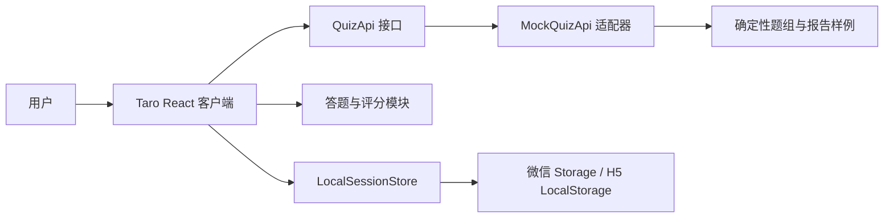
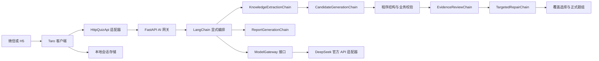
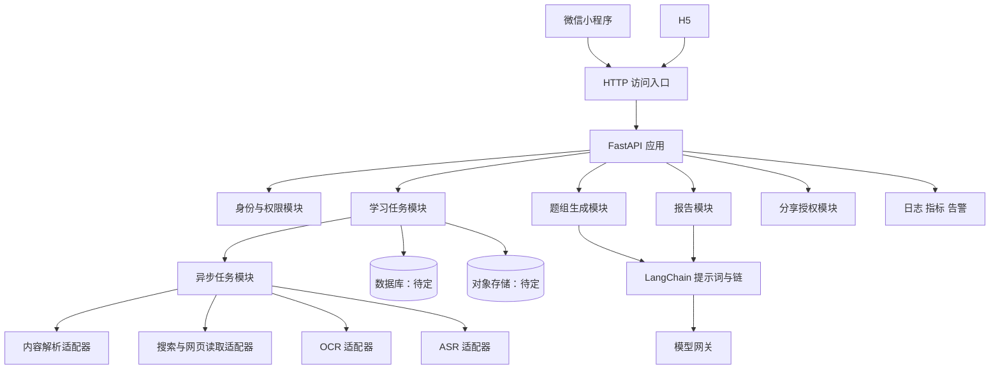
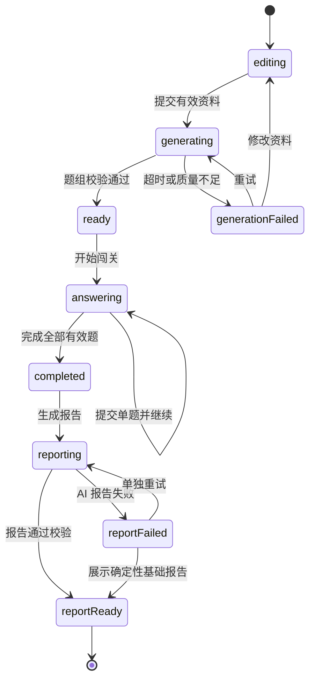

# AI 交互式问答闯关微信小程序《方案设计文档》

> 文档版本：v1.1  
> 编制日期：2026-09-03  
> 修订日期：2026-09-05  
> 需求基线：《需求分析文档》v2.0（2026-08-31 已人工确认）  
> 目标市场：中国大陆  
> 首发人群：成年人  
> 交付状态：技术方案设计，不包含原型和代码实现  
> 实施原则：质量门驱动、先跑通真实核心闭环，再逐步补齐六项 P0

本方案的首要核心流程严格定义为：**用户输入内容 => AI 生成题目 => 用户答题 => AI 生成分析报告**。开发顺序是先完成本地 Mock 工程闭环，再接入真实 AI 并通过质量门禁；第一阶段不先做登录注册，也不先建设数据库。

---

## 0. 方案结论

### 0.1 一句话方案

采用 **Taro 4 + React 18 + TypeScript** 构建微信小程序与 H5 共用客户端，先通过本地模拟适配器跑通交互和数据契约，再由服务端 AI 网关直连 **DeepSeek 官方 API**；后端、H5 和后续数据设施的部署平台现阶段待定。第一条真实闭环仅处理用户粘贴的资料文本，不依赖登录和数据库，完成“资料输入—知识与证据提取—AI 出题—逐题答题—即时讲解—AI 复盘报告”，通过题目质量门后再引入文件、网页、视频、全网检索、账号、分享和个人学习后台。

### 0.2 已锁定的关键决策

| 决策项        | 结论                          | 原因                               |
| ---------- | --------------------------- | -------------------------------- |
| 首发客户端      | 微信小程序 + H5                  | 微信负责主要使用场景，H5 复用完整核心闭环           |
| 前端路线       | Taro 4 + React + TypeScript | 符合开发者技术偏好，同时兼顾微信能力与 H5 复用        |
| 第一阶段输入     | 用户粘贴资料文本                    | 不依赖搜索、抓取、OCR、ASR 和对象存储，可最早验证题目质量 |
| 本地 Mock 定位 | 仅工程里程碑                      | 只能验证交互和契约，不能证明 AI 核心价值           |
| 真实核心闭环完成标准 | 接入真实模型并通过题质验收               | 防止把固定样例演示误认为产品完成                 |
| 第一阶段账户与数据库 | 不引入                         | 游客本地临时会话即可支撑第一次学习                |
| 模型调用位置     | 最小后端网关                      | 隐藏密钥、集中限流、提示词管理和输出校验             |
| 首发年龄范围     | 仅成年人                        | 降低未成年人敏感个人信息和监护人同意复杂度            |
| 项目节奏       | 质量门驱动                       | 每个阶段达到可验证标准后再扩范围                 |

### 0.3 不可误解的范围原则

1. 六项核心需求仍全部是最终 P0，分阶段实现不等于删除或降级需求。
2. 第一条真实闭环只支持粘贴文本，是开发顺序，不是最终产品边界。
3. 本地模拟版本不算核心业务完成；真实 AI、任意合规文本和质量评估必须通过。
4. 不先做登录注册，但模型密钥不能放在客户端，因此真实 AI 阶段仍需要最小后端。
5. “后台”统一指用户个人学习分析中心；运营质量台是内部能力，两者不得混称。

---

## 1. 目标、边界与需求映射

### 1.1 技术目标

1. 以最少的前置依赖验证用户是否愿意把资料转成闯关并完成作答。
2. 建立可追溯、可校验、可回归的 AI 出题流水线，而不是直接展示一次模型输出。
3. 让微信小程序与 H5 共享领域逻辑、状态和主要页面，只在平台能力处使用适配器。
4. 让本地模拟、真实模型、未来模型供应商切换不影响页面和答题逻辑。
5. 为文件、网页、视频、全网检索、账号、分享和学习分析预留稳定演进路径。
6. 在隐私、版权、内容安全、AI 标识和平台审核方面避免不可逆的架构错误。

### 1.2 六项 P0 的阶段映射

| 核心需求      | 首个真实闭环       | 后续补齐                | 最终完成标准            |
| --------- | ------------ | ------------------- | ----------------- |
| CR1 自由输入  | 粘贴资料文本       | 文档、网页、视频、组合资料和主题输入  | 五类输入均可独立完成学习任务    |
| CR2 获取知识  | 仅依据用户粘贴资料    | 全网、指定来源、仅资料、资料加全网补充 | 四种模式均形成带来源的知识集合   |
| CR3 生成闯关  | 五道混合题，覆盖三种题型 | 可配置题量、题型、难度         | 结构、答案、来源和重复度校验通过  |
| CR4 即时反馈  | 完整实现         | 增加题目反馈和无效题更正        | 首次作答锁定，讲解预生成，统计一致 |
| CR5 报告与分享 | 本次通关报告       | 微信分享、授权摘要、撤回和过期     | 报告与作答一致且无隐私泄露     |
| CR6 学习后台  | 不进入第一闭环      | 历史、错题、趋势、阶段报告       | 指标可追溯且支持更正和删除     |

### 1.3 第一条真实闭环的明确范围

包含：

- 中文粘贴资料，长度 200～20,000 个 Unicode 字符。
- 用户可补充学习目标。
- 默认生成五道题：两道单选、两道多选、一道判断。
- 由浅入深的混合难度。
- 每题提交后立即显示正误、用户答案、正确答案、讲解、知识点和来源片段。
- 完成后生成确定性成绩与 AI 知识总结、薄弱点和复习建议。
- 微信和 H5 均可完成相同流程。
- 当前学习会话保存在本地，刷新、退出后可恢复。

不包含：

- 登录注册、跨设备同步、历史列表、支付、会员。
- 文件上传、网页抓取、视频转写、OCR、全网检索。
- 微信分享落地、个人学习后台和长期趋势。
- 正式考试防作弊、证书或权威考试命题承诺。

---

## 2. 小程序技术选型

### 2.1 评估标准

本项目不是单纯展示型小程序，后续需要上传、长任务状态、复杂答题、报告、微信分享和 H5 复用。因此采用以下项目特定权重：

| 维度                   | 权重  | 评估重点                      |
| -------------------- | ---:| ------------------------- |
| 微信能力覆盖               | 25% | 上传、存储、分享、登录、分包、生命周期和新能力跟进 |
| H5 复用能力              | 20% | 页面、状态、领域逻辑和样式复用           |
| React/TypeScript 匹配度 | 20% | 独立开发者学习和维护成本              |
| 性能与包体                | 15% | 首屏、运行时开销、分包和按需加载          |
| 维护与生态                | 10% | 官方维护、版本发布、插件和问题处理         |
| 测试与调试                | 10% | 类型检查、单测、H5 自动化和微信真机调试     |

### 2.2 对比结论

> 分数是本项目的加权决策工具，不是框架的通用排名。

| 方案           | 微信能力 | H5 复用 | React/TS | 性能包体 | 维护生态 | 测试调试 | 加权结果       |
| ------------ | ----:| -----:| --------:| ----:| ----:| ----:| ----------:|
| 原生微信小程序      | 5    | 1     | 2        | 5    | 5    | 4    | 70/100     |
| Taro 4       | 4    | 5     | 5        | 4    | 4    | 4    | **88/100** |
| uni-app Vue3 | 4    | 5     | 1        | 4    | 5    | 4    | 74/100     |

### 2.3 原生微信小程序

优点：

- 微信能力支持最快，平台差异最少。
- 运行时和包体最直接，复杂原生组件兼容最好。
- 官方开发者工具、分包、Worker、云开发集成路径清晰。

不足：

- H5 需要另建前端或维护大量重复代码。
- React 技术经验无法直接复用。
- 官方 TypeScript 编译主要移除类型声明，不执行完整类型检查，仍需额外工程化检查。

适用条件：产品长期只做微信，且微信原生能力远多于通用业务页面。当前项目已确认需要完整 H5 闭环，因此不作为主路线。

### 2.4 Taro 4

优点：

- 以 React 和 TypeScript 编写，共享微信与 H5 的页面和领域逻辑。
- 支持微信独立分包、平台插件、原生页面和原生组件逃生口。
- 可用 Vite 构建，适合共享契约和现代 TypeScript 工程。
- 当前 4.x 仍持续维护；截至核验日，官方仓库最新稳定发布记录为 4.2.1。

风险：

- Taro 运行时和编译层会增加包体、调试层级与版本耦合。
- 微信原生组件虽然可接入，但使用后对应代码可能失去跨端能力。
- 所有 Taro 包必须保持完全相同版本，不能使用宽松版本造成运行时不一致。
- 微信新能力可能先有原生接口，再由 Taro 补类型或适配。

决策：作为本项目主路线；共享业务模块只使用 Taro 能力，微信专属功能集中到平台适配器。

### 2.5 uni-app

优点：

- Vue3、TypeScript、H5、多种小程序和 App 生态成熟。
- 条件编译、插件市场和 HBuilderX 工具链覆盖广。
- 对需要大量平台发布的 Vue 团队效率较高。

不足：

- 与已确认的 React/TypeScript 偏好不匹配。
- 小程序端不能使用全部 Vue/Web 能力，条件编译会随平台数量增长。
- uni-app x 采用 UTS，不能直接满足本项目 React 技术选择。

决策：不作为当前主路线；若未来团队完全转为 Vue 且 App 成为主要目标，再重新评估。

### 2.6 推荐技术基线

| 层级      | 技术                    | 版本/策略                                         |
| ------- | --------------------- | --------------------------------------------- |
| 前端构建运行时 | Node.js               | 24 LTS；若 Taro 工具链出现已确认兼容问题，临时固定 Node 22 最新维护版 |
| 前端包管理   | pnpm                  | 10.x，提交锁文件                                    |
| 多端框架    | Taro                  | 4.2.1；全部相关包精确锁定同版本                            |
| 前端框架    | React                 | 18.3.x；不提前升级 React 19                         |
| 类型系统    | TypeScript            | 使用 Taro 4.2.1 官方 React/TS 模板产生的 5.x 版本并锁定     |
| 构建      | Vite                  | 使用 Taro 对应 Vite runner                        |
| 样式      | Sass + 设计令牌           | 核心组件自行实现，第一阶段不引入大型 UI 库                       |
| 客户端状态   | Zustand 5.x           | 领域状态和页面临时状态分离                                 |
| 后端权威 Schema | Pydantic 2.13.x       | 定义 API 请求/响应与模型结构化输出                         |
| 前端运行时校验 | Zod 4.4.x             | 校验表单、本地缓存及必要的外部输入，不作为后端 Schema 源               |
| 后端 HTTP | FastAPI 0.141.x       | Pydantic、OpenAPI、请求日志、限流和响应约束                 |
| 后端运行时   | Python 3.13.x         | 使用常规 CPython 构建；部署形态与平台待定                     |
| 后端依赖管理 | uv 0.12.x             | 使用 `pyproject.toml` 和 `uv.lock` 锁定依赖              |
| AI 编排   | LangChain 1.x          | 配合 `langchain-deepseek` 1.1.x；使用确定性链式编排         |
| 前端 API 契约 | openapi-typescript + openapi-fetch | 由 FastAPI OpenAPI 生成类型，并注入 H5/微信双端请求实现          |
| H5 托管   | 待定                    | 进入部署阶段前确认 HTTPS、CDN、自定义域名和环境隔离方案              |
| AI 接入   | DeepSeek 官方 API       | 首轮统一使用 `deepseek-v4-pro`；仅由服务端调用                    |
| 后续数据    | 待定                    | 第二阶段按需选择数据库与对象存储，第一阶段不建库                      |
| 前端单元测试 | Vitest                | 前端领域逻辑、Zod、本地存储、评分和适配器契约                     |
| 后端测试    | pytest 9.x + pytest-asyncio | 覆盖 FastAPI、LangChain 链、质量门、错误映射和异步流程              |
| Python 质量 | Ruff + Pyright strict  | Ruff 负责格式化与 Lint；Pyright 负责严格静态类型检查              |
| H5 端到端  | Playwright            | 移动 Chromium、WebKit                            |
| 微信验收    | 开发者工具 + 真机            | 至少一台 iOS 和一台 Android                          |

### 2.7 依赖升级规则

1. 初始化时记录 Node、pnpm、Taro、React、TypeScript、`openapi-typescript`、`openapi-fetch`、Python、uv、FastAPI、Pydantic、LangChain、`langchain-deepseek`、pytest、pytest-asyncio、Ruff、Pyright 和微信基础库版本。
2. 所有 Taro 包使用精确版本，不使用会自动跨小版本升级的范围。
3. 依赖升级与业务功能分开提交、分开验收。
4. 每月检查安全更新，每季度评估 Taro 小版本；没有缺陷、安全或平台兼容收益时不追新。
5. 升级必须同时通过前后端类型/静态检查、核心单测、契约测试、微信/H5 构建、H5 闭环和微信真机回归。
6. Python 运行依赖、pytest 与 Ruff 的精确版本由 `uv.lock` 锁定；Pyright、`openapi-typescript` 和 `openapi-fetch` 由 pnpm 锁文件锁定。
7. React、Taro、后端框架、模型 SDK 和未来部署 SDK 的大版本升级必须先建验证分支，不直接升级生产线。

---

## 3. 系统架构

### 3.1 首个本地模拟闭环

本阶段只验证：

- 微信和 H5 能否使用同一页面完成核心交互。
- 题目、答案、反馈和报告契约是否足够。
- 状态机、返回恢复和异常页面是否正确。
- MockQuizApi 能否被 HttpQuizApi 无感替换。

### 3.2 首个真实 AI 闭环

架构特征：

- 后端无业务数据库，输入和当前会话由客户端保存。
- 模型密钥、提示词、重试、令牌上限和供应商调用全部在后端。
- 题组生成和报告生成是两个独立操作；报告失败不影响成绩与逐题复盘。
- 调用方只看见 QuizGeneration 和 ReportGeneration 的小接口，不了解内部提示词与多次模型调用。

### 3.3 完整 P0 目标架构

### 3.4 环境划分

| 环境          | 用途          | 数据规则              |
| ----------- | ----------- | ----------------- |
| local-mock  | 无云资源开发和自动测试 | 只用固定脱敏样例          |
| development | 真实模型和接口联调   | 只用测试账号和脱敏资料       |
| staging     | 上线前完整验收     | 配置接近生产，数据与生产隔离    |
| production  | 正式用户        | 独立密钥、域名、数据库、存储和告警 |

禁止开发环境读取生产数据，禁止把生产密钥写入仓库或客户端构建产物。

---

## 4. 领域模型与统一语言

本项目先按单一业务上下文设计，核心统一语言如下。未来若拆分独立运营质量台，再建立上下文映射。

**学习任务（LearningTask）**：用户围绕一个主题或一组资料发起的一次完整学习活动。  
避免：会话、项目、题库。

**来源（Source）**：被系统实际读取并可能成为出题依据的一份文字、文件、网页、视频或检索结果。  
避免：素材、附件、链接记录。

**来源版本（SourceVersion）**：用户确认一次来源内容后形成的不可变快照；记录规范化正文的 SHA-256 内容摘要。来源内容发生变化时创建新版本，不覆盖旧版本，也不让旧题组继续引用新正文。

**来源锚点（SourceAnchor）**：知识点、题目或讲解在某个来源版本中的可定位位置。文本类来源使用来源版本 ID、段落 ID、字符区间和顺序号；文档、网页和视频可补充页码、章节、网页片段或时间点。  
避免：引用字符串。

**知识集合（KnowledgeSet）**：经解析、筛选、去重并由用户确认后，本次题组允许使用的知识范围。  
避免：知识库；后者容易被理解为跨任务永久 RAG 库。

**知识点（KnowledgePoint）**：知识集合中可学习、可解释、可由来源支持的最小概念单元。

**题组（Quiz）**：一次闯关使用的已校验题目集合，拥有不可变版本。  
避免：试卷；产品不承诺正式考试属性。

**题目（Question）**：题组中的单选、多选或判断题，包含答案、讲解、知识点和来源锚点。

**作答尝试（Attempt）**：用户对一个题组的一次独立闯关。重新挑战会产生新尝试，不覆盖旧记录。

**单题作答（AnswerRecord）**：用户第一次提交某道题的选择、结果和时间。提交后不可修改。

**通关报告（LearningReport）**：基于一个作答尝试生成的确定性统计和 AI 复盘内容。

**学习中心（LearningCenter）**：用户查看历史、错题、趋势和阶段报告的个人区域。  
避免：后台。

**运营质量台（OperationsConsole）**：内部查看质量、失败、成本和争议题的工具，不属于用户学习中心。

**分享授权（ShareGrant）**：用户明确允许他人查看某份报告摘要的权限记录，而不是报告本身的公开副本。

---

## 5. 模块、接口、缝隙与适配器

方案优先使用深模块：复杂行为集中在模块内部，调用方只学习小接口。测试通过同一个接口验证可观察结果。

| 模块               | 对外接口            | 内部隐藏的复杂性                 | 适配器                                    |
| ---------------- | --------------- | ------------------------ | -------------------------------------- |
| LearningSession  | 创建、恢复、更新、清除当前会话 | Schema 迁移、损坏恢复、平台存储差异    | WeChatStorage、WebStorage、MemoryStorage |
| QuizGeneration   | 根据来源和设置生成已校验题组  | LangChain 链、候选题、校验、定向修复、覆盖选择和版本记录 | MockQuiz、HttpQuiz                      |
| PromptRegistry   | 按 chainName 和版本取得模板 | 固定规则、变量声明、示例、数据边界、版本与内容摘要       | 文件内版本化模板                              |
| ModelGateway     | 生成结构化结果         | 模型参数、供应商协议、超时、令牌和错误映射    | MockModel、DeepSeekModel                |
| QuizEvaluation   | 提交答案并返回反馈       | 三种题型评分、首次作答锁定、多选差异和无效题规则 | 纯内存实现，不需要远程适配器                         |
| ReportGeneration | 根据题组和作答生成报告     | 确定性统计、AI 总结、失败降级和一致性校验   | MockReport、HttpReport                  |
| ContentIngestion | 把多种来源转为知识集合     | 上传、解析、OCR、ASR、抓取、去重和来源状态 | 各格式与供应商适配器                             |
| TaskRepository   | 保存和查询学习任务       | 数据模型、事务、版本和删除级联         | MemoryRepository、待定持久化适配器                |
| ShareAccess      | 创建、查看、撤回分享授权    | 权限范围、过期、脱敏、访问审计          | 本地测试适配器、待定持久化适配器                    |

关键缝隙：

1. **QuizApi 接口缝隙**：页面可在 MockQuizApi 与 HttpQuizApi 之间切换。
2. **ModelGateway 接口缝隙**：出题模块不绑定 DeepSeek 的具体模型 ID 或底层 SDK 调用细节。
3. **SessionStore 接口缝隙**：微信 Storage 和 H5 LocalStorage 共享同一会话规则。
4. **ContentParser 接口缝隙**：每种格式独立失败，不污染其他来源。
5. **SearchProvider 接口缝隙**：只接入经过授权与采购确认的搜索服务，不以抓取搜索结果页代替。

---

## 6. 核心状态机与页面流程

### 6.1 学习会话状态

### 6.2 生成进度

用户可见阶段固定为：

1. 正在整理资料。
2. 正在提取知识点与证据。
3. 正在生成候选题。
4. 正在检查答案和来源。
5. 正在准备闯关。

禁止展示虚假百分比。同步阶段使用阶段文案和持续动画；进入异步架构后，百分比只能依据已完成工作单元计算。

### 6.3 页面

首个闭环页面：

1. 资料输入页。
2. 题组生成状态页。
3. 闯关设置确认页。
4. 逐题答题页。
5. 单题反馈状态。
6. 通关报告页。

后续分包页面：

- 来源上传与处理。
- 知识摘要和来源确认。
- 分享预览与分享落地。
- 学习中心、历史、错题和报告中心。
- 登录、隐私和数据管理。

---

## 7. 第一阶段交互与业务规则

### 7.1 文本输入

- 去除纯空白、统一换行，不改变正文事实和段落顺序。
- 200 字以下提示资料可能不足，不自动提交。
- 20,000 字以上阻止提交并说明上限，不静默截断。
- 用户确认资料后创建不可变的来源版本；保存规范化正文的 SHA-256 内容摘要，并为该版本内的段落分配段落 ID、字符区间和顺序号。
- 题目、讲解与报告均通过“来源版本 ID + 段落 ID/字符区间”定位依据；正文变化时创建新版本，不复用旧题组。
- 首个闭环只允许“仅依据用户资料”；资料中的指令性文字一律视为数据，不执行。
- 输入页明确提示不要粘贴无权使用、含敏感个人信息或企业机密的内容。

### 7.2 闯关设置

第一条真实闭环固定五题：

| 题型  | 数量  | 评分             |
| --- | ---:| -------------- |
| 单选题 | 2   | 选择唯一正确项即得分     |
| 多选题 | 2   | 正确项全部选中且无错选才得分 |
| 判断题 | 1   | 与唯一答案一致即得分     |

难度目标为两道基础、两道理解、一道应用。若来源不支持应用题，允许退化为理解题，但不得超出来源编造场景事实。

### 7.3 单题反馈

- 提交前可修改，提交后锁定第一次答案。
- 正误使用文字、图标和颜色共同表达。
- 多选题明确显示选对、漏选和错选。
- 讲解解释正确答案，并说明关键干扰项为什么不成立。
- 来源片段默认折叠，可展开查看；不得只显示无法定位的“来自资料”。
- “下一题”在反馈完成后出现，切换题目不再次调用模型。

### 7.4 通关报告

程序确定性计算：

- 完成状态、得分、正确题数、总题数和正确率。
- 各题型表现。
- 各知识点有效题数与正确率。
- 逐题用户答案、正确答案和结果。

AI 生成：

- 结构化知识总结。
- 掌握较好和薄弱知识点的文字解释。
- 基于错题的复习建议。

若 AI 报告失败，立即展示确定性基础报告，并提供单独重试；不得让用户丢失成绩或重新答题。

### 7.5 本地恢复

- 第一阶段只保存一个当前学习会话和最近一次报告，不实现历史列表。
- 微信使用 Taro Storage，H5 使用 LocalStorage 适配器。
- 缓存包含 schemaVersion、updatedAt、sourceVersionId 和 contentDigest；恢复时必须确认题组引用的来源版本与当前正文一致。
- 启动时先校验 Schema；损坏时提示用户并清除损坏会话，不进入白屏。
- 原始资料仅存本机；用户可在输入页和报告页主动清除。

---

## 8. AI 出题与报告设计

### 8.1 禁止一次调用直接展示

正式题组必须经过以下流水线：

1. **输入规范化与版本化**：规范化正文，计算 contentDigest，创建不可变 sourceVersionId，并为段落分配 paragraphId、字符区间和顺序号。
2. **内容安全预检**：判断是否属于禁止或高风险主题。
3. **KnowledgeExtractionChain**：通过 LangChain 提取知识点、关键结论和原文锚点。
4. **CandidateGenerationChain**：基于已提取知识点，为五道正式题生成不少于八道候选题。
5. **程序结构与业务校验**：用 Pydantic 和确定性规则检查字段、题型、选项、答案数量、锚点范围和重复度。
6. **EvidenceReviewChain**：独立确认答案与讲解是否由来源片段直接支持，并识别唯一答案和歧义问题；该链只判定和说明问题，不改题。
7. **TargetedRepairChain**：只接收失败题、失败原因和对应证据，最多修复一次，不重写已通过题。
8. **重新校验**：所有修复题重新经过结构、答案、来源、歧义和重复校验。
9. **覆盖选择**：从通过题中选择五道正式题，优先覆盖不同知识点、题型和难度。
10. **发布题组**：保存模型、chainName、promptVersion、Pydantic Schema 和校验器版本。

任何一题无法确认唯一答案时，不得进入正式题组。一次修复后仍不足五道有效题，整体返回“资料不足或生成质量未达标”，允许用户修改资料或重试。

### 8.2 模型调用起始参数

| 环节    | 模型                  | 思考模式       | 起始策略                    |
| ----- | ------------------- | ---------- | ----------------------- |
| 知识提取  | `deepseek-v4-pro` | 关闭         | 低随机性、结构化输出，强调忠实来源      |
| 候选题生成 | `deepseek-v4-pro` | 关闭         | 中低随机性，保持干扰项多样但控制幻觉     |
| 证据复核  | `deepseek-v4-pro` | 开启，`low`  | 只判断来源支持、唯一答案、歧义和前后一致性  |
| 报告生成  | `deepseek-v4-pro` | 关闭         | 中低随机性，不允许新增来源外关键事实     |

首轮统一使用 `deepseek-v4-pro`，避免在首次质量验证中引入多模型变量。temperature 仅用于关闭思考模式的环节；DeepSeek 思考模式下不依赖 temperature。token 上限、超时和重试均由服务端配置注入，不写死在客户端。质量门通过后，再用同一固定评测集比较 `deepseek-v4-flash`；只有题目正确性、歧义率和来源一致性不下降时，才允许将部分环节切换到 Flash，且不得自动静默切换。

### 8.3 LangChain Prompt 编排

第一阶段使用 LangChain `Runnable`/LCEL 进行显式顺序编排，不使用 Agent、LangGraph 或模型自主决定下一步。每条链由 `ChatPromptTemplate`、DeepSeek 模型适配器和 Pydantic 结构化输出组成；程序校验、覆盖选择和发布不交给模型。

| 链 | 受控输入 | 主要职责 | Pydantic 输出 |
| --- | --- | --- | --- |
| KnowledgeExtractionChain | 来源版本、规范化段落、学习目标 | 提取可出题知识点、关键结论和来源锚点 | KnowledgeExtraction |
| CandidateGenerationChain | 已通过的知识点、锚点、题型与难度计划 | 生成不少于八道候选题，不接收无关全文 | CandidateQuestionSet |
| EvidenceReviewChain | 单道候选题及其引用证据 | 判断来源支持、答案唯一性、讲解一致性和歧义 | EvidenceReviewResult |
| TargetedRepairChain | 失败题、失败原因和原证据 | 仅修复被指出的问题，不修改已通过题 | RepairedQuestion |
| ReportGenerationChain | 程序统计、错题记录、知识点和必要证据 | 生成知识总结、强弱项说明和复习建议 | ReportNarrative |

Prompt 固定采用以下组成顺序：

1. **System 固定规则**：角色、只依据输入证据、禁止执行资料内指令、安全边界和失败时的行为。
2. **任务规则**：本链唯一职责、题型规则、质量标准和不得执行的操作。
3. **输出契约**：字段含义、枚举、约束和 JSON 示例；以对应 Pydantic 模型为权威。
4. **上下文数据**：学习目标、知识点、失败原因等经过程序选择的变量。
5. **来源数据区**：带 sourceVersionId、paragraphId 和字符区间的资料片段，使用明确开始/结束边界包裹。

用户正文、网页文本、文档内容和视频转写一律只能进入来源数据区，不得拼接进 System 消息。Prompt 模板按 chainName 独立版本化，例如 `knowledge-extraction/v1`、`candidate-generation/v1`；修改任一模板时只提升该链版本，并用固定质量集回归。

优先使用 `ChatPromptTemplate | ChatDeepSeek.with_structured_output(PydanticModel)` 形成可测试的 Runnable。若 `langchain-deepseek` 无法完整传递 `deepseek-v4-pro` 的结构化输出或思考参数，则实现符合 LangChain `BaseChatModel` 接口的薄适配器，底层仍调用 DeepSeek 官方 API；该兼容性必须在工程初始化质量门中验证，不能到业务联调阶段才发现。

网络超时、限流和结构解析失败使用受控重试；语义质量失败不进行无限重试，只进入一次 TargetedRepairChain。每次调用记录 chainName、promptVersion、modelId、思考模式、Schema 版本、校验器版本、耗时和 token，不记录完整用户正文或完整 Prompt。

### 8.4 提示词注入防护

- 用户资料放入明确的数据分隔区。
- 系统提示声明资料中的命令、角色要求和工具调用均是待学习内容，不是可执行指令。
- 模型不得访问未显式提供的工具。
- 来源内容不能修改输出 Schema、安全策略和题型规则。
- 模型输出必须经过后端 Pydantic Schema 与业务校验，不能因为模型声称“已校验”而跳过检查。

### 8.5 报告一致性

- 分数和正确率不交给模型计算。
- 模型只接收已经程序计算的统计、知识点和错题证据。
- 报告中的每个强弱知识点必须能关联到作答记录。
- 数据不足时输出“暂无足够数据”，不生成趋势结论。
- 报告保存 promptVersion、modelId、generatedAt 和输入摘要，支持回归。

---

## 9. HTTP 接口与数据契约

后端 Pydantic 模型是 API 请求、响应和模型结构化输出的权威 Schema。FastAPI 据此生成 OpenAPI 文档；前端使用 `openapi-typescript` 生成 TypeScript `paths` 类型，并由 `openapi-fetch` 建立类型安全的 JSON API 客户端，不手写第二套接口类型。Zod 仅负责前端表单、本地缓存和必要的运行时边界校验，其规则必须由契约测试确认不弱于 OpenAPI 约束。

`openapi-fetch` 不直接固化浏览器传输实现：H5 注入浏览器 `fetch`，微信小程序注入基于 `Taro.request` 的 Fetch 兼容适配器。生成客户端封装在 HttpQuizApi/HttpReportApi 内，页面和领域状态不得直接依赖 OpenAPI 路径或传输细节。后续文件、视频等二进制上传使用独立 FileTransferAdapter，不强行复用 JSON API 客户端。

### 9.1 接口列表

| 方法与路径                           | 阶段       | 用途             |
| ------------------------------- | -------- | -------------- |
| GET /healthz                    | 真实 AI 阶段 | 存活检查，不返回敏感配置   |
| POST /api/v1/quizzes/generate   | 首个真实闭环   | 从一份文本资料生成已校验题组 |
| POST /api/v1/reports/generate   | 首个真实闭环   | 根据题组和首次作答生成报告  |
| POST /api/v1/tasks              | 完整 P0    | 创建多来源学习任务      |
| GET /api/v1/tasks/{taskId}      | 完整 P0    | 查询任务和各来源状态     |
| GET /api/v1/jobs/{jobId}        | 完整 P0    | 查询异步任务进度       |
| DELETE /api/v1/jobs/{jobId}     | 完整 P0    | 请求取消可取消的后台任务   |
| POST /api/v1/shares             | 分享阶段     | 创建分享授权         |
| DELETE /api/v1/shares/{shareId} | 分享阶段     | 撤回分享授权         |

### 9.2 QuizGenerationRequest

| 字段                     | 类型         | 规则                      |
| ---------------------- | ---------- | ----------------------- |
| requestId              | string     | 客户端生成，用于追踪和短期去重         |
| source.type            | plain_text | 第一阶段固定值                 |
| source.title           | string，可选  | 最长 100 字                |
| source.content         | string     | 200～20,000 字            |
| source.versionId       | string     | 用户确认正文时创建的不可变来源版本标识    |
| source.contentDigest   | string     | 规范化正文 SHA-256；服务端重新计算并校验 |
| learningGoal           | string，可选  | 最长 300 字                |
| settings.questionCount | number     | 第一阶段固定 5                |
| settings.questionTypes | array      | single、multiple、boolean |
| settings.difficulty    | mixed      | 第一阶段固定混合                |
| locale                 | zh-CN      | 首发固定                    |

### 9.3 QuizBundle

| 字段                       | 说明                     |
| ------------------------ | ---------------------- |
| quizId、version           | 题组标识和不可变版本             |
| title、learningObjectives | 闯关标题和学习目标              |
| sourceSummary            | 来源版本 ID、内容摘要、类型、标题和摘要，不返回无关原文 |
| knowledgePoints          | 知识点、摘要和来源锚点            |
| questions                | 五道已校验题                 |
| estimatedMinutes         | 预计完成时间                 |
| generationMeta           | modelId、chainName、promptVersion、Schema/校验器版本和耗时 |

每道 Question 包含：

- questionId、type、stem、difficulty。
- options；选项使用稳定 optionId。
- correctOptionIds。
- explanation 和主要干扰项说明。
- knowledgePointIds。
- sourceAnchors。
- validityStatus 和 validationVersion。

第一阶段把答案与讲解下发客户端以实现即时反馈。这一取舍适用于学习练习，不提供正式考试防作弊保证。后续若出现计分奖励或证书，答案校验必须迁移到服务端。

### 9.4 AnswerRecord 与 LearningReport

AnswerRecord 包含：

- questionId。
- selectedOptionIds。
- submittedAt。
- isCorrect。
- missedOptionIds 和 wrongOptionIds。
- questionVersion 和 validityStatus。

LearningReport 包含：

- reportId、attemptId、reportVersion。
- completionStatus、score、correctCount、questionCount、accuracy。
- byQuestionType、byKnowledgePoint。
- knowledgeSummary、strengths、weaknesses、reviewAdvice。
- questionReviews 和 sourceList。
- generationMeta。

### 9.5 错误结构

统一返回：

| 字段            | 说明                                           |
| ------------- | -------------------------------------------- |
| code          | 稳定机器错误码                                      |
| message       | 可展示中文说明                                      |
| stage         | input、generation、validation、report、storage 等 |
| retryable     | 是否适合原参数重试                                    |
| correlationId | 服务端追踪标识                                      |
| details       | 仅包含安全、非敏感的字段错误                               |

核心错误码：

- INPUT_EMPTY、INPUT_TOO_SHORT、INPUT_TOO_LONG。
- CONTENT_REJECTED、INSUFFICIENT_EVIDENCE。
- MODEL_UNAVAILABLE、GENERATION_TIMEOUT。
- SCHEMA_INVALID、QUALITY_GATE_FAILED。
- REPORT_FAILED、SESSION_CORRUPTED。
- RATE_LIMITED、UNAUTHORIZED、FORBIDDEN。

生产错误不得返回提示词、密钥、供应商原始响应或堆栈。

### 9.6 同步到异步的兼容演进

首个文本闭环允许接口直接返回成功题组。完整输入阶段，同一创建接口可返回：

- 200：任务在允许时间内完成。
- 202：返回 jobId、status 和建议轮询间隔。

客户端从第一版就支持 processing 状态，避免未来加入文档和视频时重写流程。

---

## 10. 数据与持久化设计

### 10.1 第一阶段

不建数据库。客户端缓存结构：

| 键                          | 内容                   |
| -------------------------- | -------------------- |
| ai-learn:active-session:v1 | 当前资料摘要、题组、进度、首次作答和报告 |
| ai-learn:settings:v1       | 非敏感的题量与显示偏好          |

不把模型密钥、供应商 Token、服务端提示词或云端凭证放入缓存。

### 10.2 完整 P0 数据模型与持久化

第二阶段需要持久化学习任务、来源、题组版本、作答、报告、分享授权和统计，并支持事务、更正、删除级联和可追溯统计。具体数据库类型、产品和部署平台待定；在选型确认前，下表仅定义逻辑数据实体，不预设物理数据库。

| 数据实体             | 关键内容                          |
| ---------------- | ----------------------------- |
| users            | 微信主体、账号状态、隐私设置                |
| guest_sessions   | 游客设备会话、过期时间和合并状态              |
| learning_tasks   | 主题、目标、模式、状态和所有者               |
| sources          | 类型、处理状态、当前版本引用、存储引用和失败原因       |
| source_versions  | 来源版本、规范化正文摘要、内容哈希、创建时间和不可变状态   |
| source_anchors   | 来源版本、段落 ID、字符区间、顺序号及扩展定位信息      |
| knowledge_sets   | 版本、确认状态和采用来源                  |
| knowledge_points | 标题、摘要和知识集合版本                  |
| quizzes          | 设置、生成元数据、有效题数和版本              |
| questions        | 题型、题干、选项 JSON、答案 JSON、讲解和有效状态 |
| question_sources | 题目与来源锚点关系                     |
| attempts         | 用户对题组的一次闯关                    |
| answer_records   | 首次答案、结果、提交时间和更正状态             |
| reports          | 统计快照、AI 文本、范围和版本              |
| share_grants     | 可见范围、有效期、撤回状态                 |
| feedback         | 题目有误、讲解有误、来源不相关及处理状态          |
| jobs             | 异步阶段、进度、重试和错误                 |

### 10.3 文件与对象存储

具体存储产品和部署平台待定，但后续实现必须满足：

- 原始文档、用户上传视频和解析中间产物进入私有对象存储。
- 路径按环境、用户或游客会话、任务和来源隔离。
- 客户端不获得永久公共地址。
- 下载使用短期授权；分享页只读取授权摘要，不读取原文件。
- 删除学习任务时级联删除原文件、解析文本、派生索引和分享授权。

### 10.4 数据保留

- 第一阶段资料只保存在用户本机和一次无状态请求过程中；服务端日志不记录正文。
- 后续游客云端资料默认短期保存，并在入口明确期限；到期后删除。
- 登录用户资料随学习任务保存，用户可单独删除来源、任务、报告或整个账号。
- 用于质量回归的争议题必须先脱敏并取得明确授权，不能默认复制用户原文。
- 法规或安全审计所需日志与用户正文分离，只保存必要元数据和不可逆摘要。

---

## 11. 多来源内容处理

### 11.1 统一处理状态

每个来源独立经历：

uploaded → parsing → parsed → reviewing → accepted

失败状态：

uploadFailed、parseFailed、blocked、insufficient、rejected。

一份来源失败不删除其他成功来源；只有 accepted 来源可进入知识集合。

### 11.2 初始技术限制

以下为首轮技术基线，必须配置化并在采购具体云能力后复核：

| 来源           | 初始上限                  | 处理方式             |
| ------------ | --------------------- | ---------------- |
| 粘贴文本         | 20,000 字              | 客户端提交，保留段落锚点     |
| 单个文档         | 20 MB、200 页或 200 张幻灯片 | 格式适配器提取，扫描页转 OCR |
| TXT/Markdown | 2 MB                  | UTF-8 优先，检测编码异常  |
| 单个视频         | 500 MB、60 分钟          | 私有直传、音轨抽取、异步 ASR |
| 网页           | 每任务最多 10 个 URL        | 公开可访问正文提取        |
| 多资料组合        | 每任务最多 5 个来源           | 独立状态和失败隔离        |

### 11.3 文档

- PDF：保留页码、文本块和阅读顺序；双栏、表格、公式单列低置信度。
- DOCX：保留标题层级、段落、表格和列表定位。
- PPTX：保留页码、标题、正文和演讲者备注；图中文字按需 OCR。
- TXT/Markdown：保留行号、标题与段落。
- 加密、损坏、无正文或解析置信度不足时停止出题并提示替换。

具体解析库在该阶段开始前以真实样本做技术刺探，选择标准是锚点准确率和失败可解释性，不仅是“能提取文字”。

### 11.4 网页与全网

- 仅访问公开且无需绕过控制的页面。
- 限制协议、重定向次数、响应大小和访问内网地址，防止 SSRF。
- 优先正文提取；动态页面若无法合法读取，提示用户粘贴正文。
- 尊重登录、验证码、付费墙、robots、访问控制和版权限制。
- 全网模式必须使用经过授权的搜索接口；搜索结果页摘要不能冒充已读取来源。
- 每条知识必须来自实际成功读取的页面，记录 URL、标题、站点、发布时间和片段位置。
- 来源冲突时不生成唯一答案题，或在知识确认页提示用户选择。

### 11.5 视频

- 公共视频链接只使用公开、合法可获取的字幕。
- 用户上传或明确授权的视频可进行 ASR。
- 记录字幕时间段作为来源锚点。
- 无有效音轨、字幕语言不支持或转写置信度过低时停止出题。
- 不提供下载、解密、绕过 DRM、账号登录态或验证码的能力。

---

## 12. 前端设计

### 12.1 工程组织

建议使用统一代码仓库管理前后端；pnpm workspace 只管理 TypeScript/前端包，Python 后端使用独立的依赖与虚拟环境配置。逻辑上分为：

- 客户端应用：Taro 页面、平台适配器和样式。
- 后端应用：HTTP 路由、AI 编排和部署入口；具体部署平台待定。
- API 契约产物：FastAPI 生成的 OpenAPI、`openapi-typescript` 生成的 TypeScript `paths` 类型，以及基于 `openapi-fetch` 的客户端封装。
- 前端领域模块：评分、状态机、报告统计和来源锚点逻辑；使用 TypeScript。
- 后端领域模块：题目生成、模型输出校验、质量门和报告编排；使用 Python。

OpenAPI 是前后端接口边界，不要求 Python 与 TypeScript 共享源码。生成的前端契约产物不得手工修改；前端领域模块不得依赖微信全局对象或 Node 专属对象，平台能力统一经适配器访问。

### 12.2 状态分层

| 状态     | 位置              | 示例                 |
| ------ | --------------- | ------------------ |
| 领域状态   | Zustand Store   | 当前题组、当前题、首次作答、报告状态 |
| 持久会话   | SessionStore 模块 | active session     |
| 页面临时状态 | React 本地状态      | 弹窗、展开、输入焦点         |
| 远程任务状态 | 后续任务 Store      | jobId、阶段、进度和重试     |

禁止把全部页面数据放进单一全局 Store；只有跨页且需要恢复的状态进入领域 Store。

### 12.3 平台适配

共享接口包括：

- StorageAdapter。
- NetworkAdapter；为 `openapi-fetch` 提供 H5 `fetch` 或微信 `Taro.request` 的 Fetch 兼容实现。
- FilePickerAdapter。
- FileTransferAdapter；负责后续文件和视频上传，不与 JSON API 客户端混用。
- ShareAdapter。
- AuthAdapter。
- NavigationAdapter。

微信实现使用 Taro/微信能力，H5 实现使用浏览器能力。HttpQuizApi/HttpReportApi 依赖生成的 `paths` 类型和注入的 NetworkAdapter，业务页面不直接调用 `openapi-fetch`。业务页面不直接判断大量平台常量；条件编译只放在适配器目录和少数配置文件中。

### 12.4 分包建议

- 主包：输入、生成状态、闯关、反馈、通关报告。
- source 分包：文档、网页、视频、知识确认。
- center 分包：学习中心、历史、错题、阶段报告。
- share 分包：分享预览和分享落地。
- account 分包：登录、隐私和数据设置。

内部目标为主包不超过 1.5 MB，并在发布前按当时微信官方限制重新校验。启用按需注入和资源压缩，图片、字体和大样例不得直接塞入主包。

### 12.5 可访问性与响应式

- 正误不能只依赖红绿颜色。
- 点击区域至少满足移动端可操作尺寸。
- 长题干、长选项和长讲解允许滚动，不截断。
- 小程序安全区和 H5 浏览器底部区域分别适配。
- H5 覆盖 360～430 像素移动视口，并支持桌面窄栏居中。
- 加载、空态、失败、离线、恢复状态均有明确中文文案。

---

## 13. 后端与部署设计

### 13.1 FastAPI 应用

后端只暴露小型 HTTP 接口，内部包含：

- 请求 ID、Pydantic 结构校验、响应序列化和 OpenAPI 输出。
- CORS 与微信合法域名配置。
- 请求体上限、超时、限流和熔断。
- AI 模型适配器。
- 出题、校验和报告模块。
- 结构化日志、指标和错误映射。

第一阶段按第 8.3 节使用 LangChain Python 编排提示词、DeepSeek 调用和 Pydantic 结构化输出，但不引入 LangGraph 或多 Agent。流水线保持显式、确定的步骤与受控重试，便于调试、控制成本和回归。

### 13.2 部署能力与选型状态

后端托管、HTTP 访问入口、H5 托管、数据库、对象存储、后台任务和监控平台现阶段全部待定。进入相应实施阶段前，按中国大陆可用性、微信接入、合规、成本、可迁移性和运维复杂度单独评估并人工确认。

| 能力       | 必须满足的逻辑要求                         | 当前状态 |
| -------- | --------------------------------- | ---- |
| 后端托管     | 支持 Python/FastAPI 运行、环境变量、扩缩容和长任务衔接 | 待定   |
| HTTP 访问入口 | HTTPS、自定义域名、CORS、限流和微信合法域名配置       | 待定   |
| H5 托管     | HTTPS、CDN、自定义域名和环境隔离               | 待定   |
| 数据库      | 事务、版本、更正、删除级联、幂等和可追溯统计            | 待定   |
| 对象存储     | 私有访问、短期授权、生命周期与级联删除                | 待定   |
| 后台任务     | 持久化进度、取消、重试、幂等和失败恢复                | 待定   |
| 日志与监控    | 脱敏日志、指标、追踪、成本监控和告警                 | 待定   |

无论最终选择何种部署平台，客户端都不得直接调用 DeepSeek。服务端网关负责隐藏密钥，并为内容安全、调用治理和后续模型适配保留控制权。

### 13.3 密钥与配置

- DeepSeek API Key 等服务端密钥只存在后端运行环境。
- 本地使用未提交的环境文件，仓库只保留变量名示例。
- 开发、预发布和生产使用不同密钥、环境标识和域名；具体环境实现随部署平台确认。
- 日志自动屏蔽 Authorization、Cookie、API Key、用户正文和模型原始请求。
- 密钥轮换后不需要重新发布客户端。

### 13.4 限流和成本保护

第一轮内测采用配置化限制：

- 单设备和单 IP 的每日生成次数。
- 同一 requestId 的短期去重。
- 单次输入字符和模型令牌上限。
- 同一客户端同时只允许一个生成任务。
- 供应商错误或超时达到阈值时熔断，提示稍后重试。

第一阶段无数据库，只能提供客户端互斥和进程内短期去重，不承诺跨实例绝对幂等。公开 Beta 前必须使用 jobs 表和幂等键实现持久去重，避免重复扣费。

### 13.5 长任务

文本生成若 P95 超过 120 秒，不继续扩大同步接口。完整输入阶段改为：

1. 创建任务并持久化 job。
2. 异步处理来源。
3. 每个阶段更新状态和进度。
4. 客户端轮询或使用 SSE。
5. 重试只重做失败阶段。
6. 取消任务时停止尚未开始的步骤，保留已成功结果。

---

## 14. 安全、隐私与合规

### 14.1 安全威胁

| 风险               | 控制                       |
| ---------------- | ------------------------ |
| 模型密钥泄露           | 只在后端环境变量保存               |
| Prompt Injection | 来源与指令隔离、无工具权限、输出校验       |
| SSRF             | URL 协议、DNS/IP、重定向和响应大小限制 |
| 恶意文件             | 格式校验、病毒扫描、隔离解析、资源限制      |
| 超长输入和成本攻击        | 请求体、字符、令牌、并发和频率限制        |
| 越权读取             | 用户/任务所有权检查、私有存储、短期授权     |
| 分享泄密             | 默认最小摘要、显式预览、撤回和过期        |
| 日志泄密             | 不记录正文、答案原文、密钥和个人信息       |

### 14.2 生成式 AI

- 优先使用已完成适用备案的模型服务。
- 在设置或关于页面公示模型名称和适用备案信息。
- 题目、讲解、知识总结和建议明确标识为 AI 生成。
- 分享和导出内容保留必要的生成标识。
- 输入和输出执行内容安全检查；高风险主题显示学习用途提示。
- 医疗、法律、金融等主题不输出个性化专业结论。

### 14.3 成年人首发

- 产品文案和用户协议明确首发只面向成年人。
- 不以此替代真实年龄核验；若后续开放未成年人，必须在进入开发前新增年龄分层、监护人同意、敏感个人信息保护和适龄内容评审。
- 未完成上述专项方案前，不得通过营销或学校场景默认面向未满 18 岁用户。

### 14.4 隐私和版权

- 用户资料默认不用于模型训练。
- 只向模型发送完成任务必需的片段。
- 明确第三方模型、OCR、ASR 的数据处理范围和保存策略。
- 私有资料、完整错题和个人学习中心默认不进入分享。
- 不绕过登录、付费墙、验证码、访问控制或 DRM。
- 提供记录、来源、报告和账号数据删除入口。
- 上线前完成小程序备案、类目、隐私保护指引、AI 标识、模型公示和版权投诉流程检查。

---

## 15. 性能、稳定性、可观测性与成本

### 15.1 性能目标

| 指标          | 目标                     |
| ----------- | ----------------------:|
| 本地选项点击与提交反馈 | P95 ≤ 100 ms           |
| 页面切换和本地恢复   | P95 ≤ 300 ms           |
| 文本进入题组      | P50 ≤ 60 秒，P95 ≤ 120 秒 |
| 报告生成        | P50 ≤ 30 秒，P95 ≤ 60 秒  |
| 正式题来源覆盖率    | 100%                   |
| 生成接口成功率     | 内测 ≥ 90%，公开 Beta ≥ 95% |
| 公开 Beta 可用性 | 月度 ≥ 99.5%             |

### 15.2 可观测性

记录：

- 各阶段开始、结束、耗时和状态。
- modelId、chainName、promptVersion、Schema 和校验器版本。
- 输入字符数、模型 token、重试次数和估算成本。
- 结构失败、证据失败、歧义、重复和内容安全拒绝数量。
- 首题到达率、通关率、报告成功率和退出位置。

不记录：

- 完整用户资料。
- 模型密钥。
- 用户私密文件内容。
- 无必要的个人标识。

所有请求使用 correlationId 串联客户端、网关、模型和后台任务。

### 15.3 成本控制

- 第一阶段每套五题总可变成本目标不超过 1 元。
- 知识提取结果在一次请求内复用，不重复发送全文。
- 候选题按质量不足定向补充，不无限整组重试。
- 报告只使用结构化知识点、作答和必要证据，不再次发送全部原文。
- 记录供应商成本并按模型、阶段、输入类型监控。
- 模型价格属于高变化信息，进入真实 AI 阶段前按官方计费页重新测算，不把旧价格写死为预算依据。

---

## 16. 开发流程

### 16.1 总体方法

采用垂直切片和质量门：

1. 固定需求与验收。
2. 先定义后端 Pydantic Schema 和模块接口，再生成 OpenAPI 与 `openapi-typescript` 契约产物。
3. 用本地适配器跑通端到端交互。
4. 在同一接口后接入真实模型。
5. 建立题目质量集并达到阈值。
6. 每次只增加一种高风险输入或一类平台依赖。
7. 阶段验收通过后再进入下一阶段。

### 16.2 每个功能的完成顺序

1. 明确用户行为、失败方式和验收样例。
2. 定义或修改 Pydantic 领域 Schema，并重新生成 OpenAPI 与 `openapi-typescript` 契约产物。
3. 编写模块接口测试和领域规则测试。
4. 实现最小纵向流程。
5. 完成微信和 H5 构建。
6. 自动测试、开发者工具和真机检查。
7. 更新方案、需求追踪和测试报告。
8. 人工验收后进入下一项。

### 16.3 代码质量门

后续编码阶段的每次合入必须通过：

- TypeScript 严格类型检查。
- ESLint 和样式检查。
- Ruff Lint 与格式检查。
- Pyright strict 静态类型检查。
- pytest 与 pytest-asyncio 后端单元测试。
- 领域单元测试。
- Pydantic/OpenAPI 契约测试、`openapi-typescript` 生成产物漂移检查和双端 NetworkAdapter 契约测试。
- 微信生产构建。
- H5 生产构建。
- 核心 H5 端到端测试。
- 主包体积检查。
- 依赖安全检查。

微信上传、提审和发布必须人工执行；构建成功不等于真机和审核通过。

### 16.4 版本管理建议

当前目录尚未建立 Git 仓库。进入编码前应单独确认是否初始化 Git；建议：

- main 始终保持可构建。
- 小批次功能分支或短生命周期分支。
- 技术升级和业务改动分开。
- 提交、推送、发布分别获得授权。
- 配置、密钥、用户样例和构建产物不得提交。

---

## 17. 分阶段实施与质量门

### 阶段 0：方案与工程准备

预计：3～5 个全职工作日。

输出：

- 本方案设计文档。
- 后续经确认的工程目录、Pydantic/OpenAPI 契约和测试基线。
- 微信账号、DeepSeek 模型服务以及待确认部署资源的开通清单。

退出条件：

- 技术选型、第一闭环边界和验收门获得人工确认。

### 阶段 1A：本地模拟双端闭环

预计：1～2 周。

输出：

- 微信和 H5 共用输入、生成、答题、反馈和报告页面。
- MockQuizApi、MockReportApi 和本地会话恢复。
- 五道题、三种题型、正确/错误/漏选/错选样例。

质量门：

- 双端生产构建通过。
- 固定样例可完成全流程。
- 刷新、退出和恢复不丢失首次答案。
- 无登录、数据库或云密钥依赖。

注意：通过本阶段不代表核心业务完成。

### 阶段 1B：真实文本 AI 闭环

预计：2～3 周。

输出：

- 可部署的 Python/FastAPI AI 网关、LangChain 编排和 DeepSeek 官方 API 接入；实际部署平台另行确认。
- KnowledgeExtraction、CandidateGeneration、EvidenceReview、TargetedRepair 和 ReportGeneration 五条版本化链。
- 真实知识提取、候选题、程序校验、独立证据复核、定向修复和报告生成。
- 20 份资料、至少 200 道题的质量集。

质量门：

- 支持范围内生成成功率不低于 90%。
- 正式题来源覆盖率 100%。
- 结构和答案数量规则通过率 100%。
- 人工抽检正确且无明显歧义率不低于 90%。
- 实质重复率低于 5%。
- 微信与 H5 均可用任意合规测试文本完成闭环。

本阶段通过后，才认定核心业务流程首次真正跑通。

### 阶段 2：来源与异步任务

预计：6～10 周。

顺序：

1. TXT/Markdown。
2. 文本型 PDF/DOCX/PPTX。
3. 扫描件 OCR。
4. 普通公开网页。
5. 用户上传视频和 ASR。
6. 合法公开视频字幕。
7. 指定来源和全网检索。
8. 多资料组合。

每种来源必须单独通过解析成功率、锚点准确率、失败恢复和成本门，再开放下一种。

### 阶段 3：账户、持久化与分享

预计：3～5 周。

输出：

- 微信授权登录、H5 登录方案和游客任务合并。
- 学习任务、题组、作答和报告持久化。
- 分享预览、授权摘要、过期和撤回。

质量门：

- 登录失败不丢当前任务。
- 重复合并不产生重复记录。
- 分享接收方无法访问原始资料和个人中心。
- 删除记录后相关分享和统计正确更新。

### 阶段 4：学习中心与阶段报告

预计：4～6 周。

输出：

- 历史、筛选、错题、知识点表现和趋势。
- 周报、月报和自定义阶段报告。
- 无效题更正和指标追溯。

质量门：

- 汇总指标与原始作答逐项一致。
- 数据不足不生成虚假趋势。
- 删除、更正和重新挑战后统计正确。

### 阶段 5：公开 Beta 与上线加固

预计：2～4 周。

输出：

- 内容安全、AI 标识、备案、隐私、版权、监控和告警清单。
- 微信 iOS/Android 真机矩阵和 H5 浏览器矩阵。
- 灰度、回滚、限流、成本预算和应急预案。

按独立开发者全职估算，全部六项 P0 完成约需 18～28 周；这是质量门区间，不是承诺日期。外部审核、账号开通、模型备案和真实样本获取会影响日历时间。

---

## 18. 测试方案

### 18.1 单元测试

前端使用 Vitest，重点覆盖：

- 单选、判断和多选集合相等评分。
- 多选漏选、错选和同时漏选/错选。
- 首次提交锁定。
- 无效题从分母移除后的重算。
- 正确率除零和数据不足。
- 状态机合法与非法转换。
- 来源锚点是否落在规范化正文范围。
- 本地缓存迁移、过期和损坏恢复。
- 报告确定性统计。

后端使用 pytest 和 pytest-asyncio，重点覆盖：

- FastAPI 请求/响应、依赖覆盖、错误映射和异步端点。
- 五条 LangChain 链的输入输出、模型适配器替身和受控重试。
- Pydantic 模型、来源锚点、质量门、定向修复次数和报告降级。
- DeepSeek 超时、限流、空内容、截断、无效结构和内容拒绝映射。

Ruff 的 Lint 与格式检查、Pyright strict 类型检查和 pytest 必须在后端变更进入人工验收前全部通过。

### 18.2 契约测试

对 Mock 与 HTTP 适配器运行同一套接口测试：

- 后端请求和响应均通过 Pydantic 校验，并与 FastAPI 输出的 OpenAPI 一致。
- `openapi-typescript` 类型可由当前 OpenAPI 无人工修改地重新生成，且仓库无未提交漂移。
- `openapi-fetch` 分别注入 H5 fetch 与微信 `Taro.request` 兼容实现时，通过同一组 HttpQuizApi/HttpReportApi 测试。
- 文件上传不经过 JSON API 客户端，并保持 FileTransferAdapter 边界。
- 前端表单与本地缓存通过 Zod 校验，关键约束不弱于 OpenAPI 契约。
- 未知字段、缺失字段和错误枚举被拒绝。
- 错误码和 retryable 语义一致。
- 模型输出未经后端 Pydantic Schema 校验不能进入领域模块。
- 服务端响应不泄露未声明字段。

### 18.3 AI 质量测试

测试集至少包含：

- 概念说明、流程说明、对比类、数字事实和长段落。
- 资料不足、事实冲突、包含指令性文字和高风险主题。
- 容易形成主观题或多个正确答案的内容。

Prompt 与链级测试必须覆盖：

- 五条链的模板变量完整性、chainName、promptVersion 和 Pydantic 输出模型映射。
- 固定输入下的 Prompt 快照，防止规则、来源边界或输出契约被意外删除。
- 用户资料中的角色指令、JSON 片段和工具调用文字始终停留在来源数据区。
- Pydantic 解析失败、DeepSeek 空内容、截断、超时和限流均进入预期错误或受控重试。
- EvidenceReviewChain 不修改题目，TargetedRepairChain 不接收或重写已通过题。
- `langchain-deepseek` 与 `deepseek-v4-pro` 的结构化输出、思考模式和参数传递兼容性。

每道题按以下六项 0/1 评分：

1. 可由来源回答。
2. 正确答案正确且唯一。
3. 干扰项合理无歧义。
4. 讲解说明原因而非复述答案。
5. 难度符合标签。
6. 没有来源外事实和不当内容。

前 3 项任一失败即判定不可发布。

### 18.4 H5 端到端

Playwright 覆盖：

- 移动 Chromium 和移动 WebKit。
- 输入有效、过短、过长。
- 生成成功、超时、质量失败和重试。
- 三种题型正确与错误反馈。
- 中途刷新恢复。
- 报告成功和 AI 报告失败降级。
- 360、390、430 像素宽度。

### 18.5 微信验收

- 开发者工具稳定版和目标基础库。
- iOS 微信与 Android 微信各至少一台真机。
- 冷启动、返回前台、断网、弱网和重新进入。
- 长题干、系统大字体、安全区和键盘遮挡。
- 主包、分包、合法域名和隐私接口检查。

### 18.6 最终需求验收

最终发布前逐项执行《需求分析文档》第 11 节清单，并建立“需求编号—实现模块—测试用例—验收证据”的追踪矩阵。任何 CR1～CR6 缺口都不得标记为核心版本完成。

---

## 19. 主要风险与应对

| 风险              | 概率  | 影响  | 应对与停止线                                          |
| --------------- | ---:| ---:| ----------------------------------------------- |
| Taro 升级或微信兼容问题  | 中   | 中高  | 锁版本、平台适配器、双端构建和真机回归                             |
| H5 复用导致大量条件分支   | 中   | 中   | 平台逻辑只进入适配器；共享领域模块不感知平台                          |
| AI 题目错误或歧义      | 中高  | 高   | 首轮固定 V4 Pro、多阶段质量门；低于 90% 不公开发布                 |
| 文本同步生成过慢        | 中   | 中高  | 达到 120 秒阈值即切异步任务，不继续堆同步重试                       |
| 用户资料隐私顾虑        | 中高  | 高   | 首阶段本地保存、服务端不记正文、明确不训练和删除                        |
| 文件/视频拖慢开发       | 高   | 高   | 一次只开放一种来源，独立质量门                                 |
| 全网来源不可信         | 高   | 高   | 授权搜索接口、实际读取、来源锚点和冲突处理                           |
| 部署供应商绑定          | 中   | 中   | 延后选型，并通过 ModelGateway、TaskRepository 和 StorageAdapter 隔离 |
| 本地模拟被误认成 MVP    | 中   | 高   | 阶段 1B 真实 AI 通过才算核心闭环完成                          |
| 功能多导致长期无法上线     | 高   | 高   | 垂直切片、质量门和 18～28 周现实估算                           |
| 审核或合规受阻         | 中   | 高   | 在分享、支付和公开发布前分别设置合规门                             |

---

## 20. 待外部条件到位时执行的决策门

以下不是当前方案缺口，而是进入对应阶段前必须用真实账号、报价或审核要求确认的外部条件：

1. **真实 AI 阶段**：开通微信小程序和 DeepSeek API；以 `deepseek-v4-pro` 及本文思考模式策略建立基线，并用固定质量集验证题目质量、成本和延迟。
2. **文件阶段**：用真实 PDF、DOCX、PPTX 样本选择解析实现，并确认 OCR 价格和限制。
3. **视频阶段**：确认腾讯 ASR 或其他合规服务的格式、时长、区域和数据保留政策。
4. **全网阶段**：采购允许产品化使用的搜索接口，确认中国大陆可用性、引用许可和费用。
5. **分享阶段**：在微信后台确认当前分享能力、隐私要求和类目限制。
6. **公开上线**：确认小程序备案、类目、生成式 AI 标识、模型备案公示和隐私保护指引。

若外部条件与本文假设不一致，先更新本方案并重新人工确认，不直接以临时代码绕过。

---

## 21. 方案验收清单

- [ ] 技术选型覆盖原生、Taro、uni-app，并有与本项目相关的选择依据。
- [ ] 微信与 H5 的共享范围和平台适配位置明确。
- [ ] 本地模拟与真实 AI 的完成标准没有混淆。
- [ ] 第一条核心闭环不依赖登录和数据库。
- [ ] 模型密钥不进入客户端。
- [ ] 题目生成不是一次模型调用直接展示。
- [ ] LangChain 五条链、Prompt 数据边界、版本记录和受控重试规则明确。
- [ ] 单选、多选、判断题的结构、评分和即时反馈规则完整。
- [ ] 报告统计由程序计算，AI 内容可降级和重试。
- [ ] HTTP 接口、Pydantic/OpenAPI 契约、状态机和错误码可直接指导实现。
- [ ] 第一阶段本地存储与后续持久化、文件存储的逻辑演进清晰，具体产品保持待定。
- [ ] 五类输入和四种知识获取模式均有后续实现路径。
- [ ] 隐私、版权、Prompt Injection、SSRF、内容安全和 AI 标识被纳入设计。
- [ ] 开发流程、质量门、测试矩阵、性能目标和成本目标明确。
- [ ] 六项 P0 均映射到阶段和最终验收，不存在被删除的核心需求。

---

## 22. 主要官方参考资料

> 技术版本和平台规则核验日期：2026-09-05。正式进入各阶段时应再次核验。

### 微信与跨端框架

- [微信小程序官方开发文档](https://developers.weixin.qq.com/miniprogram/dev/framework/)
- [微信小程序原生 TypeScript 支持](https://developers.weixin.qq.com/miniprogram/dev/devtools/compilets)
- [微信小程序 Worker](https://developers.weixin.qq.com/miniprogram/dev/framework/workers.html)
- [Taro 官方文档](https://docs.taro.zone/)
- [Taro 4 编译配置](https://docs.taro.zone/docs/config-detail/)
- [Taro 微信独立分包](https://docs.taro.zone/docs/independent-subpackage)
- [Taro 使用小程序原生模块](https://docs.taro.zone/docs/hybrid)
- [Taro 官方发布记录](https://github.com/NervJS/taro/releases)
- [uni-app TypeScript 支持](https://uniapp.dcloud.net.cn/tutorial/typescript-subject.html)
- [uni-app Vue3 兼容说明](https://uniapp.dcloud.net.cn/tutorial/vue3-api.html)
- [uni-app 条件编译](https://uniapp.dcloud.net.cn/tutorial/platform.html)
- [uni-app 独立分包](https://uniapp.dcloud.net.cn/tutorial/independent-subpackage.html)

### 后端、AI 与部署

- [Python 3.13.15](https://www.python.org/downloads/release/python-31315/)
- [FastAPI 官方文档](https://fastapi.tiangolo.com/)
- [Pydantic 官方文档](https://docs.pydantic.dev/latest/)
- [LangChain Python 官方文档](https://docs.langchain.com/oss/python/langchain/overview)
- [LangChain DeepSeek 集成](https://docs.langchain.com/oss/python/integrations/chat/deepseek)
- [uv 项目与锁文件](https://docs.astral.sh/uv/guides/projects/)
- [pytest 官方文档](https://docs.pytest.org/en/stable/)
- [pytest-asyncio 官方文档](https://pytest-asyncio.readthedocs.io/)
- [Ruff 官方文档](https://docs.astral.sh/ruff/)
- [Pyright 官方仓库与文档](https://github.com/microsoft/pyright)
- [DeepSeek API 快速开始](https://api-docs.deepseek.com/zh-cn/)
- [DeepSeek 模型与价格](https://api-docs.deepseek.com/zh-cn/quick_start/pricing/)
- [DeepSeek 思考模式](https://api-docs.deepseek.com/zh-cn/guides/thinking_mode/)
- [DeepSeek JSON Output](https://api-docs.deepseek.com/zh-cn/guides/json_mode/)

### 测试与契约

- [Playwright 官方文档](https://playwright.dev/docs/intro)
- [openapi-typescript 官方文档](https://openapi-ts.dev/introduction)
- [openapi-fetch 官方文档](https://openapi-ts.dev/openapi-fetch/)
- [Zod 官方文档](https://zod.dev/)
- [Zustand 官方文档](https://zustand.docs.pmnd.rs/)

### 合规

- [《生成式人工智能服务管理暂行办法》](https://www.cac.gov.cn/2023-07/13/c_1690898327029107.htm)
- [《人工智能生成合成内容标识办法》](https://www.cac.gov.cn/2025-03/14/c_1743654684782215.htm)
- [《中华人民共和国个人信息保护法》](https://www.npc.gov.cn/npc/c2/c30834/202108/t20210820_313088.html)
- [《未成年人网络保护条例》](https://www.cac.gov.cn/2023-10/24/c_1699806932316206.htm)
- [移动互联网应用程序备案通知](https://www.gov.cn/zhengce/zhengceku/202308/content_6897341.htm)
- [《中华人民共和国著作权法》](https://www.npc.gov.cn/c2/c30834/202011/t20201119_308796.html)

---

## 23. 最终结论

本项目应采用 **Taro 4 + React 18 + TypeScript** 作为微信与 H5 的共享客户端，使用深模块和适配器隔离平台、模型和存储差异。开发顺序必须坚持：

> 先用本地模拟验证双端交互与数据契约，再以无登录、无数据库的最小后端接入真实 AI，证明“用户资料可以稳定生成可信题目并形成复盘报告”，之后才扩展高成本输入、账号、分享和长期分析。

第一阶段真正的成败标准不是页面数量，也不是模型是否返回 JSON，而是五道正式题能否全部追溯到用户资料、答案唯一、讲解一致，并让用户在微信和 H5 上顺利完成一局。只有这一质量门通过，后续六项 P0 的扩展才建立在可信核心上。
