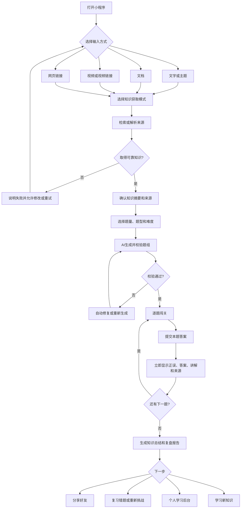
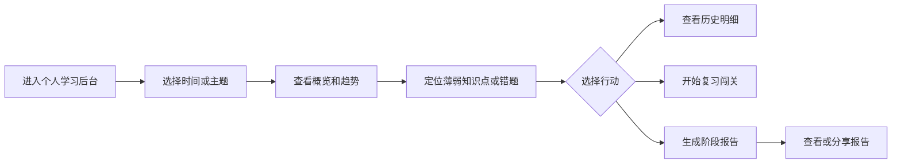

# AI 交互式问答闯关微信小程序《需求分析文档》

> 文档版本：v2.0  
> 修订日期：2026-08-31  
> 确认日期：2026-08-31  
> 产品阶段：需求已人工确认，等待下一步指示  
> 需求基准：以本次确认的六项核心需求为唯一产品需求依据

## 文档结论

本产品的核心闭环为：

> **用户自由输入想学的知识或提交资料 → AI 从全网、指定来源或用户资料中获取并整理知识 → AI 生成单选、多选、判断题组成的交互式闯关 → 用户逐题作答并即时获得答案与讲解 → 通关后生成知识总结和复盘报告并支持分享 → 用户在个人学习后台持续查看、分析和生成学习报告。**

上述闭环中的多种内容输入、知识获取、多题型闯关、即时讲解、通关总结与分享、个人学习分析后台均属于核心版本必备能力，不得作为后续可选功能移除。

---

## 1. 需求背景与产品定位

### 1.1 需求背景

传统阅读和视频学习以被动接收为主，用户难以及时判断自己是否真正理解知识，也容易因缺少互动、反馈和成就感而中断。面对网页、文档、视频或陌生主题时，用户还需要自行搜索、筛选和整理内容，学习准备成本较高。

本产品利用 AI 完成知识获取、内容整理、出题、讲解、总结和学习分析，把不同来源的知识快速转化为可互动、可反馈、可复盘、可分享的问答闯关体验。

### 1.2 产品定位

> **一款在微信内将任意学习主题或资料转化为 AI 交互式问答闯关，并提供持续复盘与学习分析的轻量学习工具。**

产品不是单纯的聊天机器人，也不是只提供固定题库的考试工具。其核心价值是将“获取知识—理解知识—答题检验—即时纠错—总结复盘—长期分析”连成完整学习闭环。

### 1.3 目标用户

1. 希望快速学习某个陌生知识点的泛知识用户。
2. 希望把文档、网页、课程视频或笔记转成自测题的职场人士和学生。
3. 正在准备面试、职业证书、课程考试或岗位培训的用户。
4. 希望长期跟踪学习主题、正确率和薄弱知识点的复习型用户。

### 1.4 用户核心痛点

| 用户痛点 | 现有方式的问题 | 产品解决方式 |
|---|---|---|
| 不知道从哪里开始学 | 搜索、筛选和整理资料耗时 | AI 自动检索全网或按指定来源获取知识 |
| 已有资料不便消化 | 文档、网页和视频内容长、重点分散 | 自动解析资料并提炼知识点 |
| 看完不知道是否掌握 | 被动阅读或观看缺少主动检验 | 自动生成多题型互动闯关 |
| 答错后仍不理解 | 普通测试只显示分数或答案 | 每题作答后立即显示正确答案和知识讲解 |
| 学完后缺少沉淀 | 知识点、错题和结论分散 | 通关后自动生成知识总结和复盘报告 |
| 复习缺少依据 | 无法了解长期学习范围和薄弱点 | 个人学习后台持续分析并生成报告 |
| 学习成果不易传播 | 手工整理分享内容成本高 | 生成可分享的复盘报告或分享卡片 |

### 1.5 产品目标

1. 让用户能够用一句话、一段话、文档、视频或网页发起学习。
2. 让 AI 能够基于全网、用户指定来源或用户提交资料形成可追溯的知识集合。
3. 用单选、多选和判断题提升学习的互动性和趣味性。
4. 用逐题即时反馈帮助用户在答对或答错时都能继续学习。
5. 用通关总结、复盘报告和分享能力沉淀一次学习成果。
6. 用个人学习后台帮助用户长期查看学习记录、答题表现和薄弱知识点。

### 1.6 核心版本范围原则

- 本文第 3 节列出的六项核心能力均为 P0，必须全部实现后才能认定核心版本完成。
- “首发”或“最小可行版本”不得被解释为只支持文本输入、只生成单选题或只展示本局分数。
- 可在不改变能力边界的前提下分阶段开发和验收，但最终交付必须形成完整闭环。
- 无可靠依据的内容不得伪装为检索结果；来源获取或解析失败时必须明确告知用户并提供恢复方式。

---

## 2. 角色、术语与使用场景

### 2.1 用户角色

| 角色 | 权限与目标 |
|---|---|
| 游客用户 | 可体验内容输入、知识获取、题目生成、答题和本次通关总结；本地临时保存当前任务 |
| 登录用户 | 拥有游客能力，并可跨会话保存学习记录、进入个人学习后台、生成历史报告和分享学习成果 |

首次体验不应被强制登录阻塞；当用户需要保存历史、跨设备查看或生成长期报告时，引导完成微信授权登录。

### 2.2 关键术语

| 术语 | 定义 |
|---|---|
| 学习任务 | 用户围绕一个主题或一份/多份资料发起的一次完整学习活动 |
| 来源 | 全网检索结果、用户指定网站/链接/来源范围，或用户提交的文档、视频、网页 |
| 知识集合 | AI 对来源内容完成解析、去重、筛选和结构化后形成的出题依据 |
| 闯关 | 由若干单选、多选和判断题组成的逐题答题过程 |
| 单题反馈 | 用户提交一道题后立即展示的正误、正确答案和知识讲解 |
| 通关报告 | 一次闯关结束后生成的知识总结、作答复盘和改进建议 |
| 学习后台 | 面向用户个人的学习分析中心，不是平台运营管理后台 |

### 2.3 典型使用场景

1. 用户输入“用通俗方式学习量子纠缠”，选择全网获取，生成闯关并完成复盘。
2. 用户粘贴一段培训内容，要求仅依据该内容出题。
3. 用户上传文档，系统解析后生成自测题。
4. 用户上传视频或粘贴公开视频链接，系统基于可合法获取的字幕或转写内容生成题目。
5. 用户粘贴网页链接，系统提取正文和页面信息后生成闯关。
6. 用户指定一个或多个网站、链接或来源范围，要求 AI 只在这些来源内获取知识。
7. 用户完成闯关后分享学习报告，并在个人学习后台查看长期正确率和薄弱知识点。

---

## 3. 核心需求与验收摘要

| 编号 | 核心需求 | 产品能力 | 核心验收结果 |
|---|---|---|---|
| CR1 | 自由输入想学的知识 | 支持一句话、一段话、文档、视频和网页 | 五类输入均能创建学习任务，并展示识别或解析状态 |
| CR2 | AI 自动获取知识 | 支持全网检索、指定来源和用户资料解析 | 能形成带来源记录的知识集合；失败时不伪造内容 |
| CR3 | AI 生成互动闯关 | 自动生成题目、选项、答案和讲解，覆盖单选、多选、判断题 | 题型规则正确、答案可校验、题目有知识依据 |
| CR4 | 自由答题并即时反馈 | 用户逐题选择；提交后立即显示答案与讲解 | 答对和答错均有讲解，反馈后可继续下一题 |
| CR5 | 通关总结、复盘与分享 | 自动生成知识总结和本次复盘报告 | 报告数据与本局一致，并可通过微信分享 |
| CR6 | 学习后台与报告 | 分析学习内容、答题记录、正确率和薄弱点 | 可按时间和主题查看，且可生成阶段性报告 |

---

## 4. 详细功能需求

### 4.1 CR1：自由输入学习内容

#### 4.1.1 输入方式

首页必须提供统一的学习发起入口，并支持：

1. **文字输入**：一句话、一个主题、一段话或较长的粘贴文本。
2. **文档输入**：核心版本至少支持 PDF、DOCX、PPTX、TXT 和 Markdown；扫描型文档可通过 OCR 提取文字，并标注识别结果可能存在误差。
3. **视频输入**：上传视频文件或粘贴公开视频链接；优先使用合法可获取的字幕，无字幕时对用户上传或已获授权的内容进行语音转写。
4. **网页输入**：粘贴公开可访问的网页 URL 并提取正文；视频网页应自动识别为视频来源。
5. **组合输入**：允许用户在一个学习任务中添加多份资料，并补充文字说明或学习目标。

#### 4.1.2 输入确认与验收

- 系统自动识别输入类型，并允许用户在提交前查看、删除错误资料或补充学习要求。
- 文件大小、时长、页数、字数和任务来源数量限制应在入口前明确展示，具体上限由产品配置，不得静默截断。
- 加密文件、损坏文件、无正文网页、无法访问链接、无有效音轨视频等情况应说明原因并允许替换资料。
- 解析后展示内容摘要或提取预览，用户确认后再进入出题；明显解析错误时可重新解析或更换来源。
- 五类输入均可独立完成端到端学习任务；多资料组合时可看见每个来源的处理状态。
- 任一来源失败不导致其他已成功来源丢失，且未成功解析的资料不得标记为已读取。

### 4.2 CR2：AI 获取与整理知识

#### 4.2.1 知识获取模式

| 模式 | 说明 | 出题边界 |
|---|---|---|
| 全网获取 | AI 围绕用户主题检索公开网络信息 | 基于实际检索并成功读取的来源，不得伪造引用 |
| 指定来源 | 用户指定网站、网页链接或一组来源 | 只使用指定范围内成功获取的内容 |
| 仅用户资料 | 解析用户提交的文字、文档、视频或网页 | 不补充范围外事实；资料不足时提示用户 |
| 资料加全网补充 | 以用户资料为主，必要时用全网信息补充 | 报告和讲解中区分用户资料与外部补充来源 |

#### 4.2.2 来源处理

1. 检索结果应经过相关性、可信度、发布时间、重复度和可访问性筛选。
2. 对时效性或争议性知识优先采用权威来源，存在冲突时呈现差异或降低题目确定性。
3. 文档按章节或段落解析；网页提取标题、正文、发布日期和站点；视频记录字幕或转写的时间位置。
4. 每个知识点保留来源名称、类型和定位信息；公开网页保留链接，文档保留页码或章节，视频保留时间点。
5. 用户可在生成前查看知识摘要、已采用来源和未采用/失败来源，删除不认可来源或追加来源后重新生成知识集合。

#### 4.2.3 失败与可信度规则

- 全网检索无有效结果时提示用户调整主题或指定资料，不得仅凭模型记忆冒充已联网获取。
- 指定来源无法访问或禁止解析时明确标记失败，不绕过登录、验证码、付费墙、访问控制或 DRM。
- 解析结果过少、乱码或置信度不足时，不自动出题，先要求用户确认或更换来源。
- 每道题和讲解应能追溯到知识集合；无法确定唯一答案的内容不得生成客观题。

#### 4.2.4 验收标准

- 四种获取模式均可创建知识集合并展示来源清单。
- 抽查题目时可追溯到实际采用的来源位置。
- 删除某来源并重新生成后，新题组不再使用该来源。
- 网络、解析或转写失败均有明确状态、原因和恢复入口。

### 4.3 CR3：AI 生成交互式问答闯关

#### 4.3.1 生成内容与题型

AI 应基于确认后的知识集合生成闯关标题、学习目标、核心知识点、题目、题型、选项、正确答案、难度、知识点标签、答案讲解、来源定位和预计完成时间。

默认题数可设为 5 道，同时允许用户选择题量或使用系统推荐题量。用户可选择混合题型或指定题型：

| 题型 | 规则 |
|---|---|
| 单选题 | 至少 2 个选项且只有 1 个正确答案 |
| 多选题 | 至少 3 个选项且有 2 个或以上正确答案；必须明确提示“多选” |
| 判断题 | 固定为“正确/错误”两个选项，且只有 1 个正确答案 |

#### 4.3.2 题目质量规则

1. 题干清晰、无无关信息，不使用无法从来源判断的主观措辞。
2. 干扰项合理，但不能通过长度、语气或格式明显泄露答案。
3. 正确答案与来源依据、讲解一致；多选题不得漏标正确选项。
4. 同一题组不得实质重复，并应覆盖多个核心知识点。
5. 难度与用户选择或系统推荐相符；未选择时采用由浅入深的混合难度。
6. 生成后完成结构、答案一致性、来源关联和重复度校验；失败时自动修复或重新生成。
7. 用户可在开局前重新生成整组题，也可在答题过程中反馈题目有误。

#### 4.3.3 验收标准

- 三种题型均能独立生成、展示、作答、评分和进入报告。
- 混合题型至少包含两种题型；题量允许时覆盖三种题型。
- 题目字段完整，结构异常题目不得进入前端。
- 代表性资料抽检时，题目可在来源中找到依据，答案与讲解一致。

### 4.4 CR4：自由答题与逐题即时反馈

#### 4.4.1 答题交互

1. 每次只展示一道题，并显示当前题号、总题数、题型和闯关进度。
2. 单选题和判断题选择一个选项后可提交；多选题允许选择多个选项后提交。
3. 提交前可修改本题选择；提交后锁定答案，避免影响首次作答记录。
4. 用户按自己的节奏继续下一题，核心版本不强制倒计时。
5. 中途退出时保存进度，返回后可继续答题或主动结束本局。

#### 4.4.2 即时反馈

每题提交后必须立即显示：

- 明确的回答正确或错误结果，不能只用颜色表达。
- 用户答案和正确答案；多选题逐项标出选对、漏选和错选。
- 知识讲解：解释正确答案为什么成立，并说明关键干扰项为什么不成立。
- 对应知识点和来源定位；网页可打开原链接，文档显示页码/章节，视频显示时间点。
- “下一题”和“题目有误”入口。

讲解随题组预生成或预加载，提交后直接展示，不再次长时间等待 AI。答对和答错都必须提供完整讲解。

#### 4.4.3 评分与验收

- 单选题和判断题与唯一正确答案一致即得分。
- 多选题默认全部选对且无错选才得分；若未来增加部分得分，须在开局前明确并在报告中保持一致。
- 本局分数、正确题数、正确率和知识点表现由首次提交答案计算。
- 经确认无效的题目从分母中排除并重新计算结果。
- 验收覆盖三种题型的正确、错误、多选漏选/错选、中途退出恢复及即时反馈。

### 4.5 CR5：通关知识总结、复盘报告与分享

#### 4.5.1 通关报告

用户完成全部有效题目后进入通关页；主动提前结束时生成“未完成报告”，并明确区别于完整通关报告。

完整通关报告必须包含：

1. 学习主题、完成时间、来源范围和闯关完成情况。
2. 得分、正确题数、总题数、正确率及各题型表现。
3. 结构化知识总结：核心概念、关键结论及知识点关系。
4. 逐题复盘：用户答案、正确答案、结果和讲解。
5. 掌握较好知识点、薄弱知识点及复习建议。
6. 来源清单及可定位信息。
7. “重新挑战”“复习错题”“学习新知识”和“生成分享内容”入口。

报告不得增加来源中没有依据的关键事实，所有统计必须与实际作答一致。

#### 4.5.2 分享能力

- 支持通过微信好友或群聊分享简洁卡片及可打开的报告页面/小程序路径。
- 卡片可展示主题、完成状态、得分或掌握亮点，但默认不展示原文、私密资料、完整错题或敏感来源。
- 用户可在分享前预览，并选择是否展示昵称、头像、得分和部分总结。
- 接收方只可查看分享者授权的摘要；无权访问原文件和个人后台。
- 分享内容删除、撤回授权或过期后，应提示不可访问。

#### 4.5.3 验收标准

- 任意题型组合完成后均能生成与作答一致的通关报告。
- 知识总结、错题、正确率、来源和建议均可查看。
- 分享卡片和报告入口均可正确唤起小程序页面。
- 私有资料和未授权个人数据不会随分享自动暴露。

### 4.6 CR6：个人学习后台与报告生成

#### 4.6.1 学习记录

登录用户的个人学习后台应保存并展示：学习任务、知识主题、输入类型、来源模式和摘要、题组、首次作答、单题结果、完成时间、通关/未完成报告、错题以及题目反馈状态。重新挑战和复习产生新记录，不覆盖历史结果。

#### 4.6.2 分析维度

后台至少支持按时间范围、主题、知识点、题型和完成状态筛选，并展示：

1. 学习次数、完成次数、累计题量和学习活跃天数。
2. 总体正确率及时间趋势。
3. 单选、多选、判断题正确率和题量分布。
4. 学习主题/知识点分布、掌握较好和薄弱知识点。
5. 错题数量、重复出错知识点和复习后的改善情况。
6. 最近学习、待完成任务、待复习内容和历史报告。

数据不足时显示“暂无足够数据”，不得输出无依据的趋势或结论。

#### 4.6.3 阶段性报告

- 用户可选择时间和主题范围，生成周报、月报或自定义阶段报告。
- 报告至少包含学习概览、答题表现、趋势、强弱知识点、错题复盘和下一步建议。
- 每个指标可追溯到具体学习记录，统计口径可查看。
- 支持查看、重新生成、删除和分享本人报告；新报告不覆盖旧报告，除非用户明确删除。

#### 4.6.4 数据更正、删除与验收

- 确认无效的题目同步修正成绩和分析指标，并保留更正说明。
- 用户可删除单次记录、单份报告或申请删除账户数据，相关分享按规则失效或脱敏。
- 历史列表可打开任一任务、作答明细和通关报告。
- 筛选结果、汇总指标和原始记录计算一致；新增、更正和删除后统计正确更新。
- 周报、月报和自定义报告均按所选范围正确生成。

### 4.7 账户、同步与游客数据

1. 游客可不登录完成首次核心闯关，当前任务保存在本地临时会话中。
2. 保存历史、跨设备访问、长期分析或管理分享时，引导微信授权登录。
3. 游客登录后可选择把当前设备任务合并到账号，重复记录不得重复导入。
4. 登录失效不导致正在进行的答题丢失；恢复登录后继续同步。
5. 用户可查看隐私政策、用户协议、AI 内容说明和个人数据管理入口。

### 4.8 异常处理与恢复

| 异常 | 用户可见处理 | 恢复方式 |
|---|---|---|
| 输入为空或无法识别 | 标出问题和支持方式 | 修改输入或更换资料 |
| 文件/网页/视频解析失败 | 显示失败来源和原因 | 重试、删除或替换单个来源 |
| 全网检索无有效来源 | 明确说明未取得可靠资料 | 调整主题或指定来源 |
| 生成超时或结构异常 | 保留已解析知识集合 | 重新生成，无需重新上传 |
| 答题中断网 | 保留当前题和已提交答案 | 恢复网络后续传或继续可用流程 |
| 报告生成失败 | 保留成绩和作答明细 | 单独重试生成报告 |
| 分享内容不可用 | 说明过期、删除或无权限 | 返回首页发起新任务 |

---

## 5. 页面与信息架构

核心版本至少包含：

1. **首页/学习输入页**：文字、文件/视频上传、网页链接、示例主题和历史入口。
2. **来源与模式设置页**：全网、指定来源、仅用户资料、资料加全网补充。
3. **解析与知识确认页**：处理进度、知识摘要、采用/失败来源及来源调整。
4. **闯关设置页**：题量、题型组合和难度。
5. **题组生成等待状态**：进度、取消和错误恢复。
6. **答题页及单题反馈状态**：题目、选项、进度、即时正误、讲解和来源。
7. **通关报告页**：知识总结、成绩、复盘、建议、来源及分享。
8. **分享预览/分享落地页**：隐私选项、授权摘要和接收方入口。
9. **个人学习后台**：总览、历史、知识分析、错题、报告中心和筛选。
10. **学习记录详情页**：题组、作答明细、来源和报告版本。
11. **个人与数据设置页**：登录、隐私、数据导出/删除和授权管理。

---

## 6. 用户操作流程

### 6.1 核心学习闭环

### 6.2 个人复盘流程

### 6.3 流程约束

1. 首次闯关不被登录阻塞，长期保存和后台分析可引导登录。
2. 提交答案后立即显示反馈；切换下一题不再次调用长耗时生成任务。
3. 来源处理、题组生成和报告生成是独立状态，任一阶段失败均保留此前成功结果。
4. 用户可明确看到系统当前处于上传、解析、检索、转写、生成、校验或报告阶段。
5. 返回历史任务时，原来源、题组、首次答案和报告版本保持可追溯。

---

## 7. 核心数据与统计口径

### 7.1 核心数据实体

| 实体 | 关键内容 |
|---|---|
| 用户 | 用户标识、登录状态、隐私设置、数据授权状态 |
| 学习任务 | 主题、用户目标、创建时间、完成状态、来源模式 |
| 来源 | 类型、名称、链接/文件标识、处理状态、定位信息、是否采用 |
| 知识点 | 标题、摘要、来源关联、在知识集合中的位置 |
| 题组/题目 | 题量、题型、难度、题干、选项、答案、讲解、知识点、来源 |
| 作答记录 | 用户首次答案、正误、提交时间、题目有效状态 |
| 通关/阶段报告 | 统计范围、知识总结、成绩、强弱项、趋势、建议、版本 |
| 分享记录 | 分享者、内容范围、权限、有效期和撤回状态 |

### 7.2 指标定义

- **完成一次学习任务**：完成该题组全部有效题目并生成通关报告。
- **正确率**：答对的有效题目数 ÷ 已提交的有效题目数。
- **闯关完成率**：完成闯关的任务数 ÷ 已进入第一题的任务数。
- **知识点正确率**：该知识点答对的有效题数 ÷ 已作答有效题数。
- **薄弱知识点**：达到最小有效题量后，正确率低于用户整体或产品阈值的知识点；阈值可配置且须说明。
- **复习改善**：同一知识点后续复习正确率相对首次正确率的变化。

统计必须排除已确认无效题和被用户删除的数据，并防止同一次提交重复计数。

---

## 8. 非功能、安全与合规要求

### 8.1 性能与稳定性

| 类型 | 要求 |
|---|---|
| 页面交互 | 选项点击、答案提交和预生成讲解展示无可感知卡顿 |
| 长任务反馈 | 上传、解析、检索、转写或生成超过 3 秒时展示持续进度，允许安全退出后返回 |
| 任务恢复 | 网络中断或退出后保留已上传来源、题组和已提交答案 |
| 幂等性 | 连续点击不得重复创建任务、扣减额度或保存作答 |
| 兼容性 | 覆盖主流 iOS/Android 微信版本和常见手机屏幕 |
| 可观测性 | 记录各阶段成功率、耗时、错误类型和恢复结果，不采集无必要的私密原文 |

文件大小、视频时长、页面数量和生成耗时等量化指标在技术方案阶段结合服务能力确定，并在上线前写入验收基线，但不得据此取消任何核心输入类型。

### 8.2 可访问性与易用性

- 正误不能只靠红绿颜色区分，同时使用文字和图标。
- 选项、按钮、进度、加载和错误状态有清晰文案。
- 长题干、长选项和长讲解不被截断，支持正常滚动。
- 视频转写、文档 OCR 和网页解析标识可能存在的识别误差。

### 8.3 内容安全与 AI 质量

- 对用户输入、外部来源和 AI 输出执行必要的内容安全检查。
- 对违法、高风险或不适宜生成客观题的内容明确拒绝或限制。
- AI 生成的题目、讲解、总结和建议应有清晰标识。
- 提供“题目有误”“讲解有误”“来源不相关”等反馈渠道及处理状态。
- 医疗、法律、金融等高风险主题展示适当提示，不把学习内容表述为专业结论或个性化建议。

### 8.4 隐私、版权与来源边界

1. 只处理完成任务所必需的数据，不默认将用户上传内容用于模型训练。
2. 私有文件、视频和学习记录默认仅本人可见，除非用户主动授权分享。
3. 明确保存期限、删除机制及第三方模型/解析服务的数据处理范围。
4. 仅解析用户有权使用或公开可访问的内容；不绕过登录、验证码、付费墙、访问控制或 DRM。
5. 分享和报告引用外部内容时控制展示范围并保留必要来源。
6. 上线前完成微信小程序、生成式 AI、个人信息保护、版权及相关备案/审核检查。

---

## 9. 埋点与产品效果指标

### 9.1 核心事件

- 首页访问、输入方式、来源模式和任务提交。
- 文件上传、网页解析、视频字幕/转写、全网检索的成功、失败和耗时。
- 知识摘要确认、来源调整、题组生成和重新生成。
- 到达第一题、每题提交、查看讲解、题目反馈和中途退出。
- 完成闯关、生成报告、复习错题、重新挑战和学习新主题。
- 进入学习后台、筛选分析、生成阶段报告、分享成功和分享打开。

### 9.2 核心指标

1. 各输入类型的任务创建成功率。
2. 来源获取/解析成功率和平均耗时。
3. 题组生成成功率、题目有效率和题目争议率。
4. 到达第一题比例、闯关完成率和退出位置。
5. 即时讲解查看率和题目反馈率。
6. 通关报告成功率、复习启动率和分享率。
7. 学习后台使用率、阶段报告生成率和用户复访率。

埋点不得保存无必要的文件原文、视频内容、网页全文或敏感个人信息。

---

## 10. 核心版本完成定义

同时满足以下条件，核心版本才可认定完成：

1. 用户可用一句话、一段话、文档、视频和网页五类输入独立创建学习任务。
2. 系统可从全网、指定来源、仅用户资料和资料加全网补充四种模式获取知识。
3. 实际采用的知识和题目可追溯到来源；系统不伪造检索或解析状态。
4. AI 能生成并校验单选、多选和判断题，包括选项、答案、讲解与来源。
5. 用户逐题自由作答，每题提交后立即看到正误、正确答案和知识讲解；答错也有完整讲解。
6. 通关后能生成知识总结和复盘报告，并能安全分享给微信好友或群聊。
7. 登录用户可在个人学习后台查看历史、答题情况、知识点表现和错题，并生成周报、月报或自定义报告。
8. 来源失败、生成失败、断网、退出和报告失败后均可恢复，不丢失此前成功结果。
9. 隐私、版权、AI 标识、内容安全、数据删除和小程序合规要求完成上线检查。
10. 第 11 节全部核心验收项通过，且六项核心需求不存在被标记为“后续再做”的缺口。

---

## 11. 需求功能核对与验收清单

### 11.1 输入与知识获取

- [ ] 支持一句话、主题和多段文字输入。
- [ ] 支持 PDF、DOCX、PPTX、TXT、Markdown 文档上传与解析。
- [ ] 支持视频上传、公开视频链接、字幕提取及授权内容转写。
- [ ] 支持普通网页解析，并能识别视频网页。
- [ ] 支持同一任务添加多份资料和学习目标。
- [ ] 支持全网、指定来源、仅用户资料、资料加全网补充四种模式。
- [ ] 展示知识摘要、采用来源、失败来源和来源定位。
- [ ] 来源失败、内容不足或冲突时明确提示，不伪造资料。

### 11.2 题目生成与答题

- [ ] 单选、多选、判断题均可生成、展示、评分和统计。
- [ ] 可选择混合/指定题型、题量和难度。
- [ ] 每题包含题干、选项、答案、讲解、知识点和来源定位。
- [ ] 完成结构、答案一致性、来源关联和重复度校验。
- [ ] 不确定、无唯一答案或无来源依据的内容不生成客观题。
- [ ] 每次展示一道题，提交前可修改，提交后锁定首次答案。
- [ ] 每题提交后立即展示正误、用户答案、正确答案、完整讲解和来源。
- [ ] 多选题能区分全对、漏选、错选和多选。
- [ ] 中途退出后可继续，已提交答案和反馈不丢失。

### 11.3 通关报告与分享

- [ ] 通关后自动生成知识总结、成绩和逐题复盘。
- [ ] 报告展示强项、薄弱知识点、复习建议和来源清单。
- [ ] 报告统计与题组、首次作答和有效题状态一致。
- [ ] 支持分享卡片和可打开的报告页面/小程序路径。
- [ ] 分享前可预览并控制个人信息和总结的展示范围。
- [ ] 私有资料、完整错题和个人后台不会默认被分享。
- [ ] 分享撤回、删除和过期状态正确生效。

### 11.4 个人学习后台

- [ ] 登录用户可查看学习历史、任务、题组和作答明细。
- [ ] 支持按时间、主题、知识点、题型和完成状态筛选。
- [ ] 展示学习次数、题量、正确率、趋势、强弱知识点和错题。
- [ ] 展示复习后的变化，数据不足时不输出虚假趋势。
- [ ] 支持生成周报、月报和自定义阶段报告。
- [ ] 报告指标可追溯到记录，统计口径可查看。
- [ ] 无效题更正、记录删除和账户删除会更新统计与分享状态。

### 11.5 异常、安全与兼容性

- [ ] 验证空/超长输入、损坏/加密文件和不支持格式。
- [ ] 验证无正文网页、不可访问链接、无字幕/无音轨视频。
- [ ] 验证网络超时、模型异常、题组结构错误和报告失败。
- [ ] 验证连续点击不会重复创建任务或作答记录。
- [ ] 验证断网、退出和重新登录后的恢复与同步。
- [ ] 验证主流 iOS/Android 微信版本和不同屏幕尺寸。
- [ ] 验证输入、来源、AI 输出、分享和个人数据的安全边界。
- [ ] 验证用户可删除记录、报告和账户数据。

### 11.6 六项核心需求最终确认

- [ ] CR1：自由输入文字、文档、视频、网页——已完整实现并通过验收。
- [ ] CR2：从全网或指定信息源自动获取知识——已完整实现并通过验收。
- [ ] CR3：自动生成单选、多选、判断题及答案讲解——已完整实现并通过验收。
- [ ] CR4：逐题自由作答并即时反馈，答错也讲解——已完整实现并通过验收。
- [ ] CR5：通关后生成知识总结、复盘报告并分享——已完整实现并通过验收。
- [ ] CR6：个人学习后台分析知识与答题情况并生成报告——已完整实现并通过验收。

---

## 12. 非核心扩展边界

以下能力可在核心闭环完成后另行评估，不作为六项核心需求的替代或阻塞项：

- 多人实时 PK、排行榜、赛季和段位。
- 每日任务、金币、连续签到和复杂成长体系。
- 创作者市场、公开题库交易和教师班级管理。
- 会员、次数包、充值和支付。
- AI 题目配图、数字人讲解和语音答题。
- 企业组织空间、复杂权限审批和私有化部署。

---

## 13. 人工确认记录

需求方已于 2026-08-31 人工确认本 v2.0 需求文档，确认结论如下：

1. 六项核心需求均为必须实现的 P0 能力。
2. “后台”指用户个人学习分析中心，而非平台运营管理后台。
3. 五类输入和四种知识获取模式符合当前产品需求。
4. 题量、难度、文件类型及视频时长等限制在后续设计中配置，但不得缩减核心能力。
5. 分享功能遵循本文规定的默认隐私范围和接收方可见边界。
6. 本 v2.0 文档正式替代原 v1.0 需求范围，作为后续工作的需求基线。

> **当前状态：需求文档已确认；尚未开始产品原型、技术方案或代码开发，等待需求方进一步指示。**
